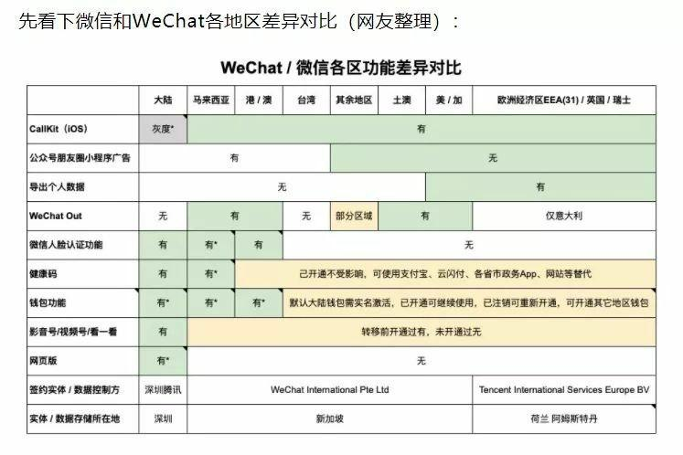
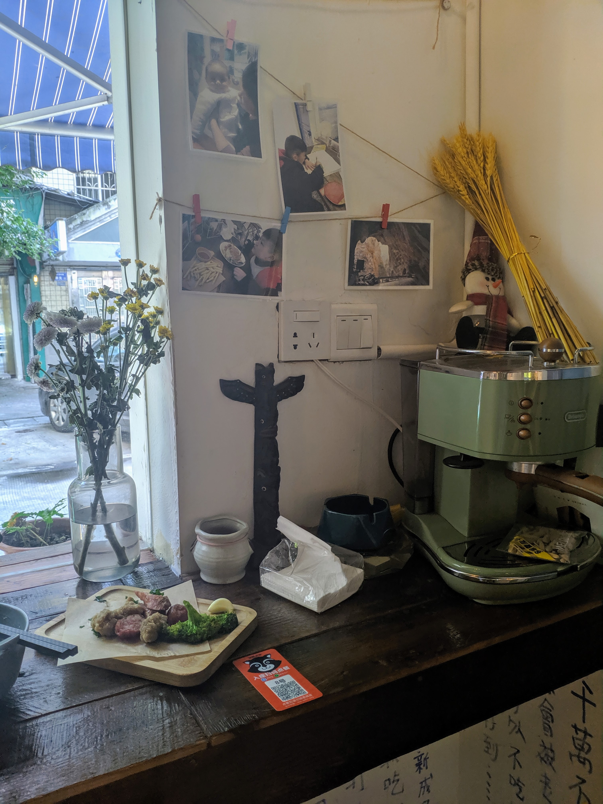

+++
author = "Wyane"
title = "臺灣學生在長沙生活指北"
date = "2021-09-22"
description = ""
tags = [
    "Life",
]
categories = [
    "Colorful",
]
series = ["Themes Guide"]
aliases = ["migrate-from-jekyl"]
image = "background.jpg"
license="Written by Daniel"
lastmod="2022-04-02"

+++
## 序言
作爲一個在大陸生活多年的臺灣人，原本以爲已經完全適應了大陸的生活，卻在某一天去辦證的途中徹底破防，所以萌生了寫一篇關於長沙生活的blog的想法，也是爲了能夠方便來到長沙念書生活的臺灣人，希望能夠幫助到你們。
> 注：
> 這篇文章記錄的城市是在湖南省長沙市
> 
> 如果在其他城市生活，那麼這篇文章可能並不能夠幫助到你
> 
> 因我個人了解到的情況有限，我只能將發生在我身上的情況寫下來；如有出錯，歡迎聯系我進行修改
>

## 來長沙前要做的準備
 **App**

* Wechat

作爲一款幾乎和大陸人綁定的社交軟體，一但你要來到大陸生活就不可避免一定會使用到

公衆號，WeChat Pay......都是你在這裏必須用到的功能

只需要手機號碼即可注冊（不限號碼地區）
>注：
>
>似乎 Wechat 和微信之後會有較大的區別（鎖區）使用+886 號碼注冊的話應該是歸類於 Wechat 
>
>具體區別看圖：
>

* QQ

理由幾乎同上 別人用你不得不用 

一般學校通知羣或者班級羣組都喜歡在 QQ 上發出

可以使用Tim代替（比較簡潔的App）

* 高德地圖

地位相當於在臺灣的Google map 功能多樣 可以實現實時公交追蹤，路線規劃等功能 

實用性還是相當不錯 就是廣告較多 

還可以直接用它打車

* 支付寶 AliPay

支付軟體 和上面 WeChat pay 同一功能 只要實名認證通過後綁定銀行卡就可以隨意使用

這兩款支付軟體相當於臺灣的PayPal和Google Pay吧 

不過還有點區別，在有些場合只能使用AliPay付款，有些只能使用WeChat Pay（不過在整改這種現象）

* 購物App

淘寶 京東 當當......一衆的購物軟體 可以讓你體驗天天收到包裹的快感

其實你可以先買需要的東西送到學校 然後等開學再到學校拿就好 省去你到長沙再購買生活用品的時間

* 美團外賣/餓了嗎

外賣軟體 

**出行**

**ios**

這裏推薦ios自帶的**錢包**軟體 

>**步驟：**
>
>1. 進入 錢包 界面 添加新的卡 點擊右上角的 + 圖示
>2. 選擇 公交卡
>3. 選擇 中國大陸-長沙瀟湘卡 
>4. 之後完成後面的儲值步驟就完成了 

以後只需拿出手機刷就可以隨意乘坐長沙的交通工具 並且也享受同等優惠待遇

**Android**
* 大陸廠商出產的手機（需要帶有NFC功能）

可以 使用這些廠商自帶的錢包軟體 也可以添加瀟湘卡進行使用

* 使用 湘行一卡通 App
通過下載 湘行一卡通 綁定 Wechat 進行付款 

需要掃描你手機app中的QR Code
>可能需要激活Wechat Pay 才能使用 （**需用臺胞證進行實名認證**）
>
>如果沒有條件激活的話 可能你暫時只能通過**購買實體票**的方式乘坐地鐵

 **網路** 

這裏要先做個小小的說明，大陸的網路帶有自己的審核機制和監管，也就是有「牆」。因爲一些「原因」，大陸的架起了高高的「[長城防火牆（GFW）](https://zh.wikipedia.org/wiki/%E9%98%B2%E7%81%AB%E9%95%BF%E5%9F%8E)」，使得大陸網民無法訪問到一些國外的網站。所以我們想要使用像 [Instagram](https://www.instagram.com)  ,  [Telegram](https://web.telegram.org/) 這類軟體的話，就需要用到一些小小的方法突破這道「牆」。
下面我依舊會根據設備推薦幾個方法：
>注：這裏我只會推薦app，可能在後面我會專門推出一篇文章來說明使用方法

**ios**

* [Quantumult](https://apps.apple.com/tw/app/quantumult/id1252015438) / [Quantumult X](https://apps.apple.com/tw/app/quantumult-x/id1443988620) 
* [shadowrocket](https://apps.apple.com/tw/app/shadowrocket/id932747118)

**Android**

* [Clash for Android](https://github.com/Kr328/ClashForAndroid/releases/tag/v2.4.13)
* [V2rayNG](https://github.com/2dust/v2rayNG/releases)
* [SSR](https://github.com/shadowsocksrr/shadowsocksr-android/releases)

 **Windows** 

* [Clash](https://github.com/Dreamacro/clash/releases/tag/v1.7.1)
* [V2rayN](https://github.com/2dust/v2rayN/releases)

**Mac OS**
* [ClashX](https://github.com/yichengchen/clashX/releases)
* [QV2ray](https://github.com/Qv2ray/Qv2ray/releases)

**日常用品**

長沙是一個氣候不太「友好」的城市，帶有一點「冬冷夏熱」的極端復雜天氣的感覺。
於是我們在這裏，就要時刻準備好以下物質：

* 雨傘/雨衣
>長沙天氣多變，而且雨天居多如果出門 還是時刻帶好雨具比較好

* 不怕沾「水」的鞋子
例如 一些 籃球鞋 它們的防水性能一般不錯 或者可以準備一雙洞洞鞋 比較方便
>這一項也是爲了雨天而做準備。
>雨天一到來，你出門的困擾可能也會是鞋子不夠穿，因爲你的鞋子都被雨水侵蝕了。

* 防曬霜
這應該不用我過多介紹了

## 當你初到長沙
>注：以下內容皆爲個人觀點

許多來大陸念書的臺灣人可能會覺得長沙是一個比較繁華的城市，因爲可能你們大部分接觸到的內容都是大陸非常繁華的城市，例如：北京，上海，廣州，深圳...... 如果你是這樣想，那麼你可能要馬上轉變一下觀念。

長沙直到目前爲止還只是作爲「新一線」城市的存在。「一線」城市，在大陸就是北京，上海，廣州，深圳這四座城市；至於對這個「新」的理解，你可以理解爲英文中的現在進行時，就是還在以一線爲目標發展和努力。所以要是你把它和上海進行對比，似乎也不太公平，畢竟兩座城市相差的還是有點「距離」。

不過作爲大陸的「網紅」城市之一，長沙遊玩的地方確實也不少，不過這就是後話了，之後我會再介紹。

好了，不管你是坐飛機，還是坐高鐵，就已經來到了長沙這個城市。
如果你乘坐飛機，應該是在黃花機場降落，那麼你則前往你就讀的大學。

方案一 磁浮快線+地鐵
>假如你是湖南大學的新生，你的下一站則是去到自己的宿舍報道，我們這裏以天馬宿舍爲例，則你需要從 磁浮機場站 乘坐磁浮快線到達 磁浮高鐵站，再步行到 長沙火車南站 地鐵站 乘坐地鐵4號線 到達 阜埠河 站，然後步行到 湖南大學天馬學生公寓 ，整個過程會耗時大約1小時10分鍾，花費24人民幣。
>
>>以上數據來自 高德地圖

方案二 出租車
>我們這裏仍然引用上述例子，那麼打車的費用可能在72～80人民幣的區間，花費的時間在55分鍾左右。
>
>>以上數據來自 高德地圖

根據以上例子，如果是獨自前來長沙，我還是推薦 方案一 的方式。因爲兩種方案所花費的時間其實很接近，但 方案一 花費較少。（如果有錢當我沒說XDDDD）

其實長沙的交通線還算發達，目前地鐵是有五條線路，公交車網路也鋪滿整片長沙。幾乎你想去的地方，通過地鐵或者公交都能夠到達。

## 景點

當然，剛來到長沙，更需要熟悉這裏的環境。剛好可以趁着報到後空餘的時間在這裏轉轉。作爲大陸著名的網紅城市，長沙的景點和遊玩地區自然不會少。

* **嶽麓山**

位於河西大學城附近，山頂的風景也十分優美，不管是觀賞日出日落，還是總覽湘江夜景，都是個不錯的平臺。而且山上也有許多不錯的小景點，像 愛晚亭，嶽麓書院...... 晚上也可以去到 麓山寺 前的平臺上參觀夜景。
>因爲河西三所大學都坐落於嶽麓山下，所以每間大學內都有小路通往山上。所以在凌晨時分上山  或者不想預約上山，就可以通過學校內的小路上山。
>由於疫情原因，通過大門上山需要提前預約預約。

* **橘子洲**

假日人很多，而且裏面很大，一般需要乘坐遊覽車。

* **冬瓜山**

網紅打卡地，有很多小吃，菜館。

* **五一廣場/國金街**

shopping mall  衣服，化妝品，奢侈品...... 應有盡有
>作爲一名科技發燒友，我一般去這個地方都是衝着 小米之家 ， IFS 裏面的 Sony 專櫃和 Samsung 專櫃 去的
>
>不得不說這裏算是長沙最綜合的購物中心 能滿足任何人的需求
>
>也是長沙假日最爆滿的地方之一

* **太平老街**

小吃街 
>這地方一到假日人超級爆滿的多 
>
>多到我難以用言語形容
>
>  一條不到1Km的街 可能你要用40分鍾才能走完

* **文和友**

網紅打卡地

## 餐廳
>以下餐廳均可通過 高德地圖 搜索到詳細地址

* **初炸 臺灣鹹酥雞**

位於 天馬小區 的一家主打 臺灣口味的餐廳，頭家是臺灣人。

味道不錯，也有 大腸麵線 蚵仔煎 等臺灣道地小吃 主要能解「鄉愁」吧。

頭家和頭家娘人都很好 可以和他們聊天 也可能會遇到其他的臺灣客人 可以一起聊天

他們家養了一只小狗狗 叫「肉圓」可以逗他 但是不能喂「她」吃東西

* **後湖 重慶小面**

可能會有點辣，但是我覺得很好吃，一到飯點一般都會排隊 

* **仙廟燒雞**

燒雞，燒排骨，煲仔飯，粉絲...... 都很好吃 

分量較大，一個人去吃可能吃不完，比較適合聚餐

## 你在大陸所需要的證件
當你來到這裏，你需要辦理一些在大陸的身份證件。像是支付軟體，都會要求你進行實名認證才能使用。所以辦理這些證件是十分必要的。

* **臺灣人民來往大陸通行證（臺胞證）**

這張證件十分重要，不過一般在你入境時，就會先去辦理這張證件了。

如果因爲一些原因，你需要再次辦理或換新證，那麼可能下面的內容會幫助到你。
**辦理步驟：**
1. 先在 地圖 中 搜索 長沙市公安局人口與出入境接待大廳
>這裏可能會去錯地點。我們要去的是長沙市公安局，但因爲市公安局位於雨花區，而雨花區也有個一市公安局雨花分局。所以千萬不要去錯了地點，確認自己去的是市公安局而不是區分局。
>
>記得帶齊自己的身份證件
2. 到達後往裏面走，到 出入境接待大廳 走到 前臺 和工作人員說明你需要辦理 臺胞證
3. 他會讓你去到左手邊的房間先拍照 
4. 拍好照片後，再去到 前臺 取號 
5. 等叫到號碼後 再去到櫃臺進行辦理

* **臺灣人民居住證**

這是一張類似於 大陸身份證 的證件，會讓你在網上實名的時候更加方便。
**辦理步驟：**
1. 先確認你的學校所在的區域，例如嶽麓區，雨花區.....
2. 然後在 地圖 中搜索你所位於的區中的市公安分局
>例如 如果我是 湖南大學 的學生，我就要去 嶽麓區的公安分區與出入境接待大廳
3. 去往 出入境接待大廳 進行辦理.

* **暫緩義務役 辦理**
1. 打印學校在讀證明
2. 帶上自己的臺胞證
3. 建議 去往 長沙市麓山公證處 進行辦理 

## 結語
希望這篇文章能讓你更快的適應在長沙的生活

如果有要詢問的地方也可以透過Telegram聯系我 

如有出錯，也請聯系我進行更改 
