+++
author = "Wyane"
title = " 一些「翻牆」軟體的使用方法 "
date = "2021-11-16"
description = ""
tags = [
    "Technology",
    "GFW",
]
categories = [
    "Technology",
]
series = ["Themes Guide"]
aliases = ["migrate-from-jekyl"]
image = "background.png"
license="Written by Daniel"
lastmod="2021-12-20"

+++

> 此文章最後修改於 2021 / 12 / 20 

# 索引

寫這篇文章，源至於我在寫[《臺灣學生在長沙生活指北》](https://7waynelee.github.io/p/%E8%87%BA%E7%81%A3%E5%AD%B8%E7%94%9F%E5%9C%A8%E9%95%B7%E6%B2%99%E7%94%9F%E6%B4%BB%E6%8C%87%E5%8C%97/)時的一個想法，也算對讀者的一個承諾。

「翻牆」這個話題，在大陸來說，還是一個比較敏感的話題。這個行爲其實觸犯了大陸的法律，相關的內容可以了解查詢[中華人民共和國網路審查](https://zh.wikipedia.org/wiki/%E4%B8%AD%E5%8D%8E%E4%BA%BA%E6%B0%91%E5%85%B1%E5%92%8C%E5%9B%BD%E7%BD%91%E7%BB%9C%E5%AE%A1%E6%9F%A5)，這其中就包括了對「翻牆」這個行爲的定義。

但以我個人生活在大陸這些年，對大陸的了解，其實有六成以上的人會使用簡單的工具進行翻牆。所以如果你有這個習慣或者需求，其實你並不是少數人。

如今，我覺得「翻牆」是一種很重要的生存手段。如果你在大陸長期生活，避免不了會有這種需求。當你需要查詢資料，收看新聞時，「牆內」的訊息也很難滿足你的需求。所以這篇文章，可能可以幫助到你。

再來說說這篇文章。這篇文章我主要會分爲理論和實踐兩方面來寫。理論方面會在這裏介紹一些歷史，名詞，工具等等一類;而實踐方面，我則會着墨於如何使用一些主流的工具。會想講到理論，其實是希望每個人都能對你用到的東西能有一些了解，就算是淺顯的部分也可以。我覺得這能幫助你如何使用或者在出現問題時，你能夠有基本的動手能力。古人雲：「授人以魚不如授人以漁」，這才是比較重要的部分，而後面的實例，只是給你一個簡單的示範。當你有這方面的知識之後，你也可以寫出自己的教程。

如果在閱讀文章的過程中你有任何的問題或者你覺得我的文章有錯誤，都可以來Telegram上找我，
我會很高興收到你們的建議。


## 理論內容
### 什麼是「牆」

牆，其實是中華人民共和國國家防火牆，也稱「[長城防火牆](https://zh.wikipedia.org/wiki/%E9%98%B2%E7%81%AB%E9%95%BF%E5%9F%8E)」，常用簡稱是GFW（取自 **G**reat **F**ire **W**all）。其實對官方來說並沒有GFW這個稱謂，只是後來民間興起和演變，這個綽號也被越來越多人熟知，於是也就變成了一種習慣名稱。

爲什麼會有「牆」，其實起因有很多。因爲涉及衆多政治因素，這裏不做過多說明。

GFW主要作用於分析和過濾中華人民共和國境內外網路間的相互訪問。這句話其實說明了GFW的工作其實是雙向性的，一是限制大陸網民訪問某些境外站點，二是限制國外的用戶訪問國內的站點。

### GFW的主要工作方式

在談到這個之前，我想先簡單的介紹一下一般情況下，在無GFW幹擾下訪問網站的過程。
* 一般情況下，在無GFW幹擾下訪問網站的基本過程
  
  在瀏覽器輸入你所要訪問的[網站域名](https://zh.wikipedia.org/wiki/%E5%9F%9F%E5%90%8D)，你的電腦會生成一個數據包，通過你的本地網路接入[骨幹網](https://zh.wikipedia.org/wiki/%E4%B8%AD%E5%9B%BD%E4%BA%92%E8%81%94%E7%BD%91%E9%AA%A8%E5%B9%B2%E7%BD%91)，再通過[DNS](https://zh.wikipedia.org/wiki/%E5%9F%9F%E5%90%8D%E7%B3%BB%E7%BB%9F)域名解析，解析出你輸入的域名所要訪問的服務器ip地址，再傳入服務器中，服務器經過處理，會返回一個數據包到你的電腦。
  
  可能會有點難理解，但這個過程可以類比成「寫信-寄出-收信-回信」。當你寫信時，信封上需要有收信人的地址，這個地址就類似於上面的網站域名，寄出後，信回先到一個大的中轉站，然後會分發給信差，這步就類是於傳入服務器前的動作。然後收信人收到信後再回信，就類似於服務器接受請求返回數據包。其中發往服務器的過程中需要經過很多的地方，這些名詞你可以自行檢索，了解他們各自的工作。
  

再來介紹在有GFW工作下訪問網站的過程

在前面的部分幾乎一樣，都是把數據包由本地網路接入骨幹網，再通過DNS解析，再來到GFW。接下來就會由GFW展開工作了。一般來說，GFW有三種基本工作原理：

  1.ip黑名單

在GFW內，可能有一張巨大的ip黑名單，上面都是被屏蔽的ip地址。當域名經過DNS解析後，ip地址可能就會和黑名單中的ip地址進行檢索比較。如果你所訪問的網站的ip地址在這張名單上，就會被屏蔽。

不過，這個方法的缺點也很明顯。如果單純採用這個方法進行工作，許多網站並不止有一個ip地址。如果另一個ip地址不在黑名單內，則可以正常訪問。

  2.關鍵字過濾

當你傳輸過來的數據包含一些敏感詞的時候，就會馬上被中斷連接

  3.DNS劫持

因爲一般網路數據包都是明文流量，GFW可以直接看到你所要訪問的地址。當知道你要訪問一些不能訪問的網站時，DNS會自動解析出一個錯誤的ip地址，或者直接不解析地址，讓服務器無法和你的電腦建立連接。

上面講到的三種方法，其實是最簡單或者說基礎的方法，如今GFW逐漸完善，也多了其他很多的攔截方法。

### 突破 GFW 的幾種方法
* 早期 Http 代理
  
  後來人們逐漸發現，只要 GFW 無法偵查到我的流量意圖，也就是我發送一個帶有**加密請求**的數據包到 GFW ，那麼 GFW 就無法進行攔截。於是早期的很多 http 代理都是依賴這些模式進行突破。
  
  簡單的講解一下過程。當你發送一個請求時，你的本地計算機會發送一個帶有加密請求的數據包，再接入本地網路，再到骨幹網，再由 DNS 解析，發現是去一臺沒有被「牆」的服務器（我們稱它爲中轉服務器）上，GFW 便會放行，然後到達這臺所謂「中轉」服務器上後便會解密數據包到真實你所要訪問的 ip 地址，再去往真實的服務器地址。之後服務器會返回數據給「中轉」服務器，再傳回你的本地計算機。
  
  這套邏輯很簡單，但也有很大的弊端。這個弊端就是帶有明顯的「特徵」。你的每一次請求所發送的數據包，都是帶有加密請求，並且會去往一臺中轉的服務器上。久而久之， GFW 的維護人員就嗅到了這個特徵。所以 GFW 也具有了攔截這些代理的功能。也因爲太多人採用這種方式突破，使得這種特徵實在他太過於明顯。所以現在單純 http 代理的 VPN 幾乎斷絕了。
  
* Shadowsocks 的出現及衍生工具
  
  可以說 Shadowsocks 的出現是這段歷史中最精彩的一個節點。[Shadowsocks](https://github.com/shadowsocks/) 的作者是 [Clowwindy](https://github.com/Clowwindy) ，其原理也是通過一個加密的數據包來欺騙 GFW ，但與上面說的不同點再於， Shadowsocks 是基於**本地端**-**服務器端**這樣一個架構，在本地端運行時，數據包就已經完成了加密，使得 GFW 並不清楚你的意圖，也不帶有明顯的特徵，到達遠端 Shadowsocks 服務器後，再進行解密，去往你要去的地址。
  
  當然革命性的技術的出現，讓 GFW 的維護人員十分頭疼。因爲流量加密（雖然只是簡單的 sock 加密），但也足夠騙過 GFW 去訪問他們不想讓你訪問的網站，並且也不能禁止所有的加密流量通過，因爲加密流量中還會有很多的正常的流量需要通行。所以讓 GFW 很難攔截此類流量。
  
  之後 Shadowsocks 就因爲政府介入，原來的 Shadowsocks 專案也被迫刪庫。但因爲有很多人 fork 了此專案，使得副本還有很多的使用者維護。後來 Clowwindy 也恢復了此專案。
  
  但因爲有了 Shadowsocks 的這套理論邏輯，也演變出了其他的工具。例如 V2ray ，Clash ，SSR 等一系列的工具軟件。這些軟件在某些細節上可能有不同，但都是基於 Shadowsocks 的基本原理。
>這段內容可能會導致一些人誤解 Shadowsocks 只是爲了用來突破GFW，其實這只是其中的一個功能。 Shadowsocks 其實是一個流量安全加密框架，其實是用來進行流量加密，可以更安全的進行傳輸。 Shadowsocks 也不算是一個「單獨的」軟體，它需要有伺服器端和用戶端才能正常使用。伺服器可以是任何的 vps，亦或者是你所購買的節點。而用戶端則是通過你所使用的裝置上的軟體。只有兩端進行連接後，才能正常使用。

### 一些詞語或名詞
* 「飛機」和「機場」
  
  這個詞的來源挺有意思。早期有節點供應商的時候，爲了「避諱」，就在想一個比較好的詞來表示他們。因爲 Shadowsocks 的圖標是一個灰色的紙飛機，所以就會用「飛機」來代替這些節點。而飛機就需要一個停機坪，一般的飛機都停在機場內，所以就把提供節點的供應商稱作「機場」，機場老板一般叫「機場主」。
  
  這個稱呼沿用至今，不管是任何類型（即使不是 Shadowsocks sock5協議的節點）的節點供應商都被稱爲「機場」。
  
  這個稱謂也是爲了和**加速器**進行區分。
  
* 關於「線路」的名詞
  
  這裏會簡略的提到一些機場常用的線路，幫助大家在選購「機場」時有一個初步了解。
  >這裏所介紹的線路，還是比較淺顯的。在自己選購的時候，一定要基於自己的情況來選擇。
  >
  >而且機場水深，還是不要單純看他標榜的線路，自己實測一下還是最好的。

  **IPCL**
  
  全稱是 International Private Leased Circuit ，翻譯成中文爲“國際私用出租線路”。
  
  這條線路 is awesome ，因爲實際上這是一條專線，傳輸不經過公網，只會經過內網，這就說明這條線路本不過牆，也就是你發送的請求是不會經過 GFW 。
  
  要說缺點，可能真的就只有「貴」吧，一般來說帶寬小流量低。當然並不是說好的線路就不會卡。再好的線路多人一起用，都會出現卡噸的情況。 
  
  **[CN2](https://zh.wikipedia.org/wiki/%E4%B8%AD%E5%9B%BD%E7%94%B5%E4%BF%A1%E4%B8%8B%E4%B8%80%E4%BB%A3%E6%89%BF%E8%BD%BD%E7%BD%91)**
  
  全稱是 ChinaNet Next Carrying Network ，縮寫爲 CNCN ，也就是 CN2 ，翻譯過來就是“中國電信下一代承載網”。
  
  特點就是採用了 QoS 技術，這是163骨幹網路所沒有的技術。QoS 簡單理解就是能夠識別你網路中的流量的需求，從而調整帶寬速率。比如你在玩遊戲時可能不需要這麼高的速率但需要低延遲，QoS 就能自動偵測進行調整。 
  
  **BGP**
  
  這個一般稱爲「多線機房」，他會根據你的網路服務商來自動連接到最適合你的連接服務。
  
  **IEPL**
  
  全稱是 International Ethernet Private Line ，翻譯成中文爲“國際以太網專線”。
  
  這條線路算是真正的端到端的**以太網**線路，一般的大型跨國企業可能會選擇這條路線。因爲是以太網線路，則只需要 MAC地址 就可以直接配置線路，並且更加穩定，也有更快的速率。

* VPS
  
  全稱是 Virtual private server ，翻譯成中文就是虛擬專用伺服器。其實就是一臺**實體**伺服器，再通過一些技術分割成一個個獨立的虛擬伺服器。因爲他們分割之後並沒有各自的實體，本質上還是共用一臺伺服器，所以就叫做**虛擬**伺服器。
  
  每個VPS都可分配獨立公網IP位址、獨立作業系統、實現不同 VPS 間磁碟空間、記憶體、 CPU 資源、行程和系統組態的隔離，為使用者和應用程式類比出「獨占」使用計算資源的體驗。 VPS 可以像獨立伺服器一樣，重新安裝作業系統，安裝程式，單獨重新啟動伺服器。
  
  一般的服務中，也不會使用到一整臺伺服器。爲了節省資源，也就會分成一個個 VPS 分別使用。所以一般我們把這個**實體**伺服器稱謂「母雞」，下面的 VPS 就稱謂「小雞」。一般的節點服務，都是用 VPS 搭建的。
  
* 流媒體解鎖
  
  爲什麼想談這個問題呢，因爲其實這不僅是在大陸才有需要。如果你想要訂閱流媒體服務並且收看其他國家區域的流媒體，也會有「翻牆」的需求。比如說，我在香港購買了 Netflix 港區的流媒體服務，但我還想看一些只有新加坡區獨家的節目，那麼我就可以選擇「翻」到新加坡，然後觀看新加坡的節目。
  
  但這些流媒體供應商是會審查你是否使用了  proxy(代理) 。一般來說，一些大的 VPS 的提供商的 IP 是直接被流媒體商家屏蔽掉的，就是這些 IP 是無法訪問流媒體網站的。 像是 Netflix 和 Hulu ，還會對你的IP注冊地址和所在國家是否一致。如果你的節點的 VPS 所在的國家和節點 IP 的注冊地址不一致的話，也是無法使用這些流媒體服務的。
  
  從21年來，流媒體大範圍的開始屏蔽一些網絡服務商的 IP。因爲一些機場使用 cookie 共享流媒體帳號，來讓用戶使用。就導致了一個帳號會有上百個人使用，這就讓商家不願意了，於是開始屏蔽掉一些網路服務商的 IP。不過就目前來說，還是可以正常使用流媒體。
  
  如果你需要流媒體服務的話，就要選擇帶有流媒體解鎖的機場。
  
## 應用操作部分

### 關於「機場」的選購
我並不會給別人推薦什麼「機場」，因爲這其實因人而異。地理位置，網路服務商其實都會對你的實際體驗有影響。所以我還是會建議你先從一些有一定使用人數和年份的「老機場」，再去購買來體驗實測，你覺得好用再長期購買。

### 使用工具方法
#### **Mac OS**
##### ClashX
  先到 ClashX 的 [releases]() 下載 **ClashX.dmg 檔案**
  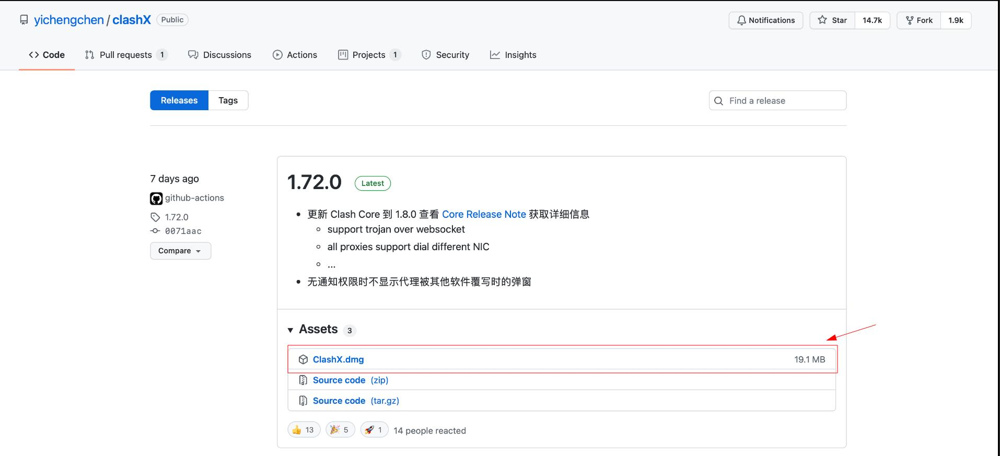
  
  下載完成後，雙擊**打開檔案**，雙擊 **ClashX 圖標**
  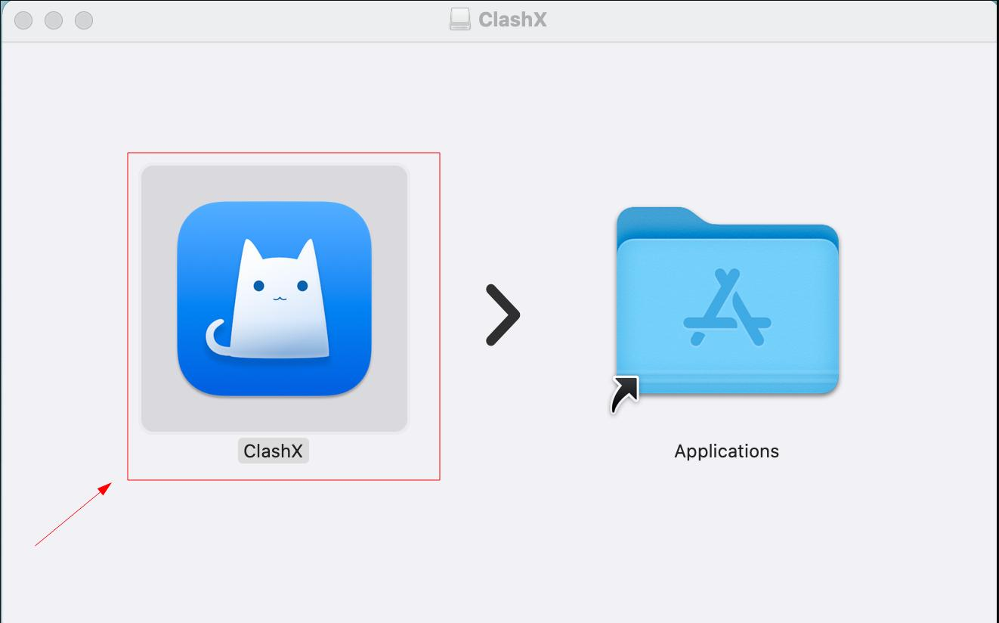
  
  點擊 **打開** 按鈕
  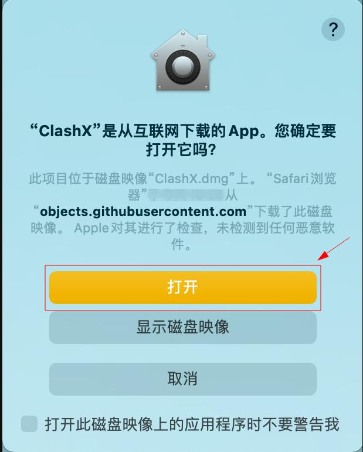
  
  安裝完成後，可以到**應用選單**上找到 ClashX，單擊打開
  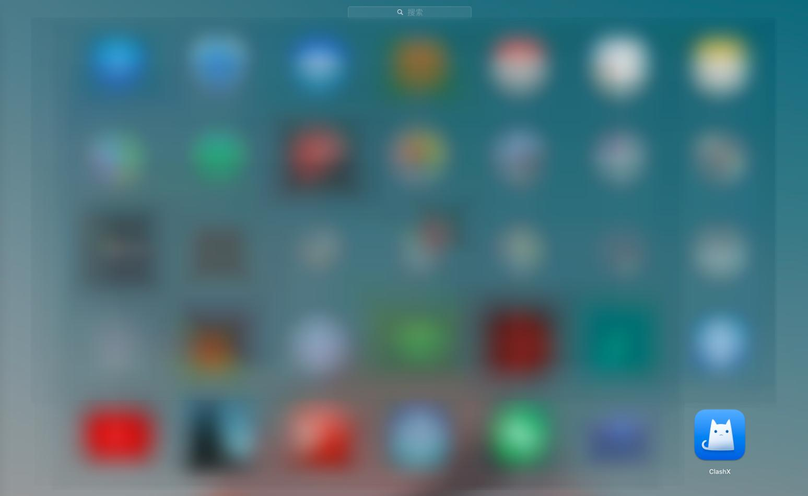
  
  打開之後，可以在任務欄上看到 ClashX 的**圖標**
  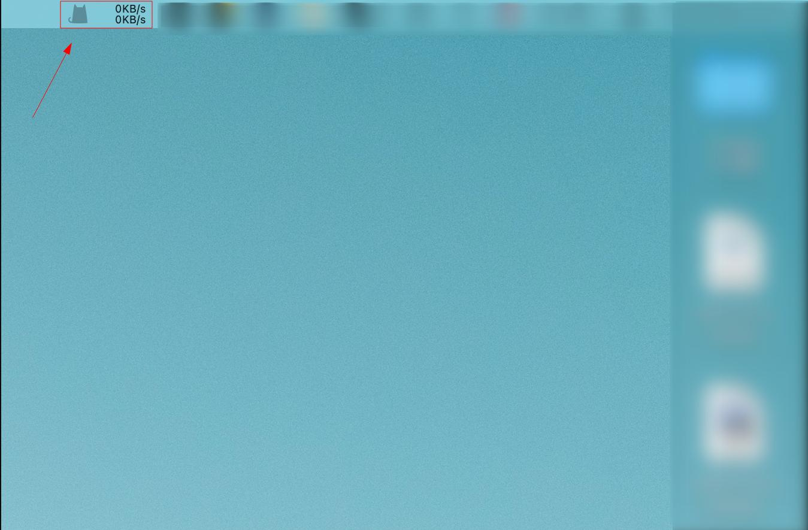
  
  右鍵**狀態欄圖標**，可以看到展開的選項列表
  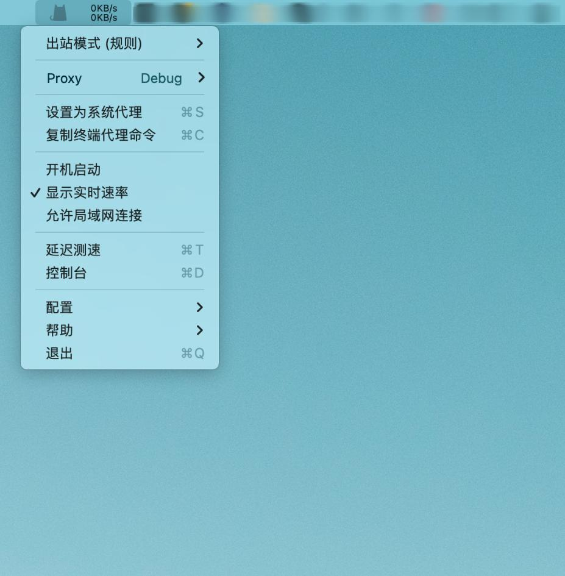
  
  選擇並單擊 配置-託管配置-管理 
  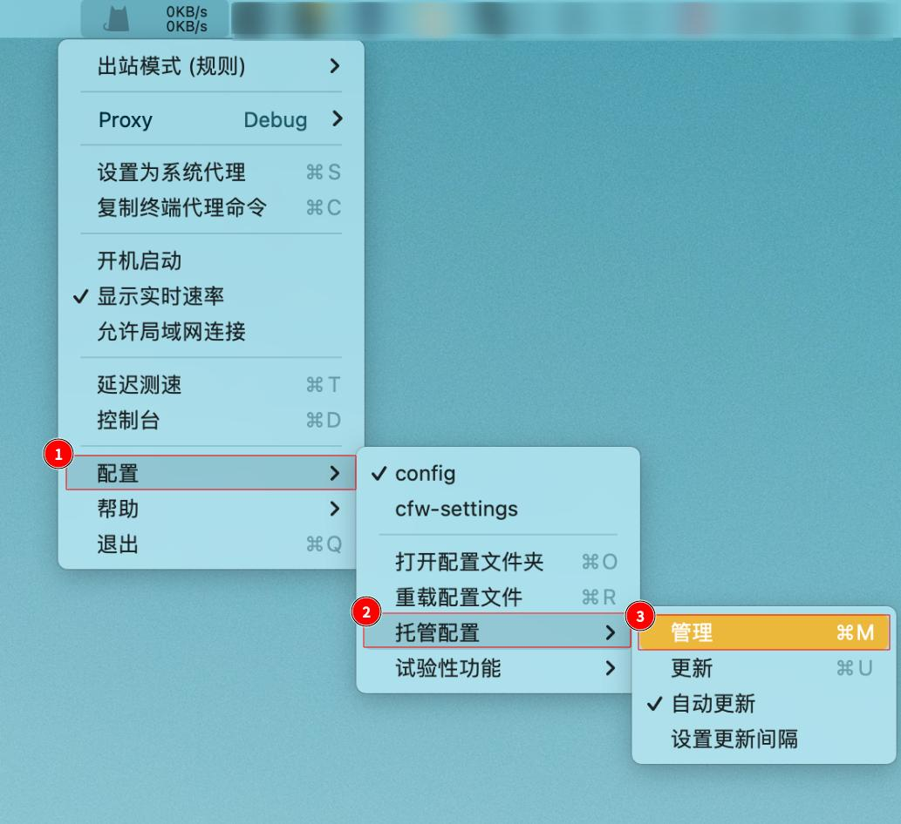
  
  點擊 **添加**
  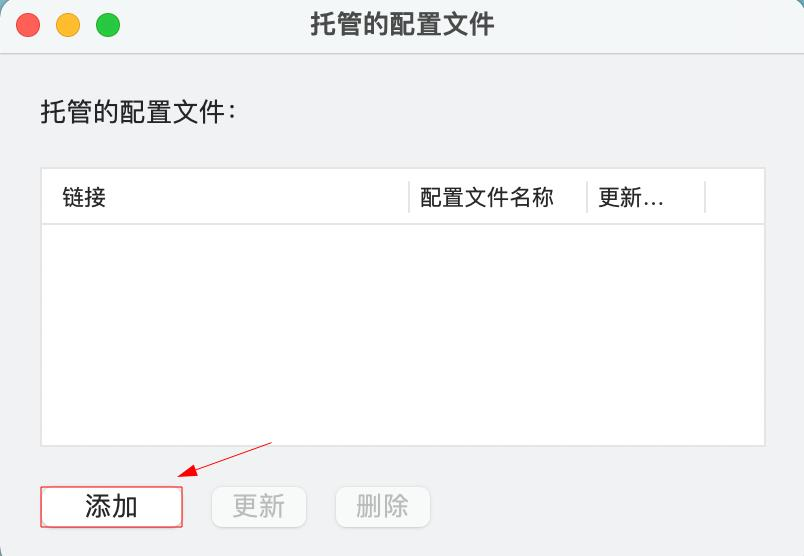
  
  將機場的訂閱地址，復制到 **Url** 欄內; **Config Name** 欄可以隨便取一個名字。然後點擊**確定**
  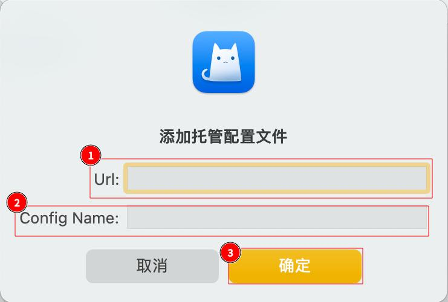
  
  然後回到上一個界面，先**單擊選定配置文件**，再點擊**更新**，最後點擊**確定**
  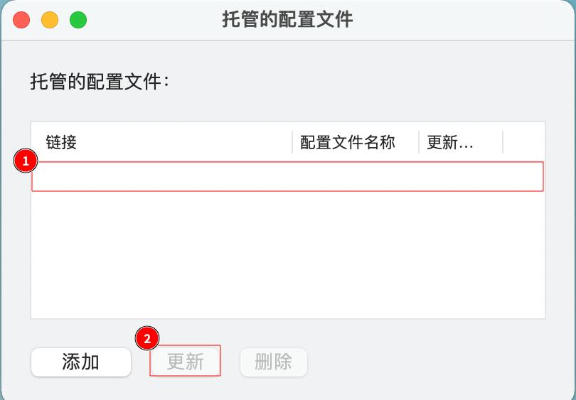
  
  再右鍵**狀態欄圖標**，點擊**設置爲系統代理**
  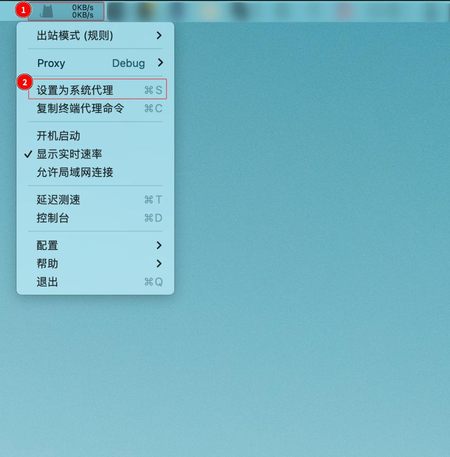
  
  再回到桌面，右鍵**狀態欄圖標**，選擇**配置**，在上面的控制文件中，選擇你的**配置文件**。
  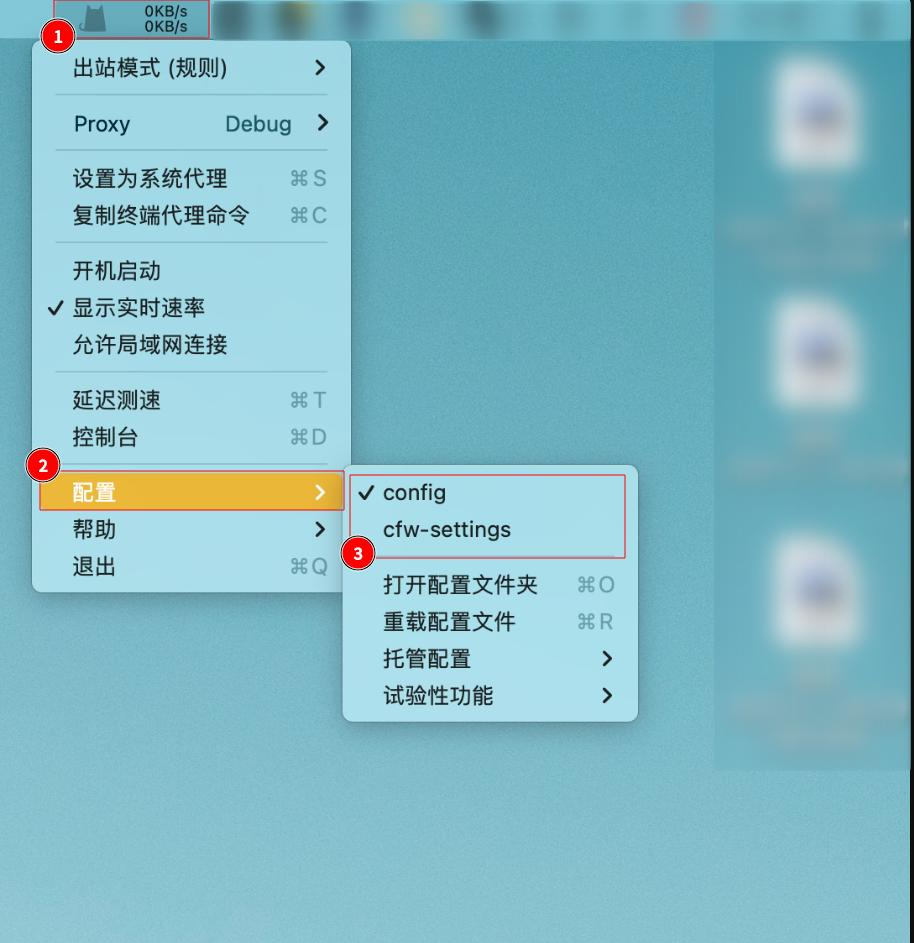
  
  再右鍵**狀態欄圖標**，選擇**出站模式**，可以選擇**全局模式**，也可以選擇**規則模式**。
  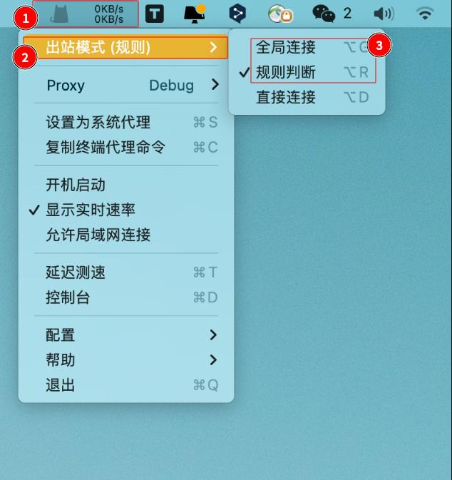
  
* 關於使用 ClashX 會遇到的問題
  
  **一.無法安裝**
  
  這可能需要系統通過一個權限，允許通過其他渠道安裝軟體。
  
  **二.某些軟體無法代理**
  
  可能會需要自己開啓代理。
  
  可以在 **設置--網路--Wi-Fi--高級--代理**
  
  勾選 網頁代理（HTTP）
  
  一般來說 Clash 的 HTTP 代理端口爲 127.0.0.1：7890，自己添加輸入一下就好。
  
  如果個別軟體可以自己啓用 proxy ，也可以單獨的使用 HTTP 或 Socks5 proxy。
  

#### **ios**

* Shadowrocket
  
  **一.簡介**
  
  Shadowrocket 相信是很多 ios 用戶所接觸到的第一款「翻牆」工具。性能高，穩定，流暢並且輕巧和易上手等特性，使得很多人使用。
  
  在教程中，簡單的添加**節點**或**訂閱**部分我會省略。重點着墨於其他的功能配置。
  
  **二.購買方式**
  
  Shadowrocket 在除中國大陸區以外的 App Store 都有上架。目前港區價格是 23 HKD。
  
  **三.進階功能配置**
  
  我們在**首頁**，可以看到**全域路由**的選項， Shadowrocket 的路由配置有四種：

  1.配置
  
  選用配置規則的方法來進行鏈接。在底欄的第二個選項**配置**的中，點擊，在**本地檔案**欄就可以看到你現在選中的配置。一般 Shadowrocket 會有一個自帶的配置。你也可以添加自己的配置，使網路連接在自己定製的「規則」範圍內進行。例如分流（例如國內IP直連，國外網站自動走代理），去除廣告等功能的實現。
  
  2.代理
  
  全局代理
  
  3.直連
  
  不通過代理，直接訪問網路。 簡單來說就不使用節點訪問網路。
  
  4.場景
  
  Shadowrocket 的場景功能是可以通過你當前所連接的Wi-Fi或移動網路來切換節點或關閉代理。
  
  就先來講講**配置**這個方式，實現一些其他的功能。
  
  對於一般使用者來說，要自己寫配置文件有點困難。我們可以使用 Github 上別人開源的一些項目，導入別人寫好的配置。
  
  例如我在 Github 上找到了一個項目：https://github.com/0x7E/rules-conf
  
  他在 readme 裏寫了詳細的簡介，也寫了使用方法和問題解答，我們就用他白名單過濾+廣告做例子，嘗試使用他的配置文件。這個配置文件的規則是直連國內網站+代理境外網站+廣告過濾。
  
  我們先復制他的規則地址。
  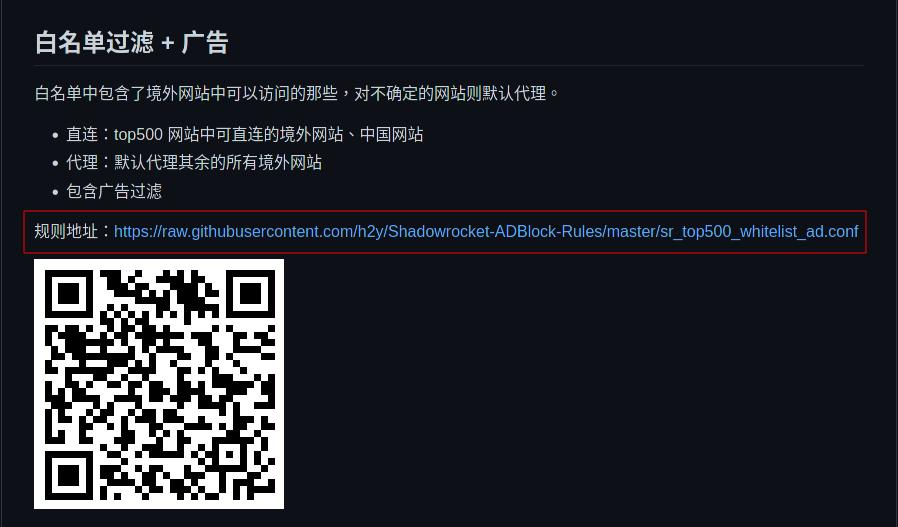
  
  再回到 Shadowrocket ，點擊底欄中的**配置**，在點擊**右上角+加號**，將復制下來的地址**粘貼**進去，點擊**下載**。
  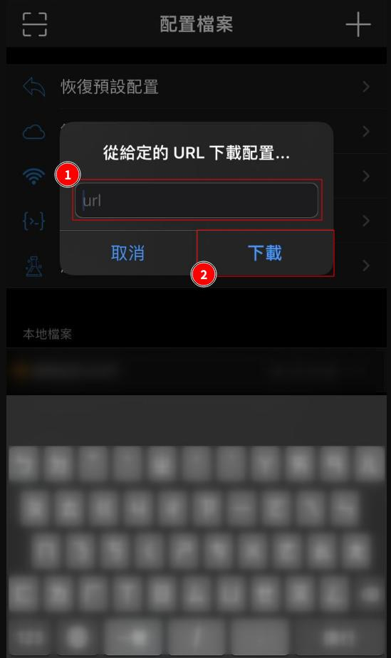
  
  然後就能看到**遠端配置**中多了一個以鏈接命名的配置文件，點擊它，再點擊**使用配置**。
  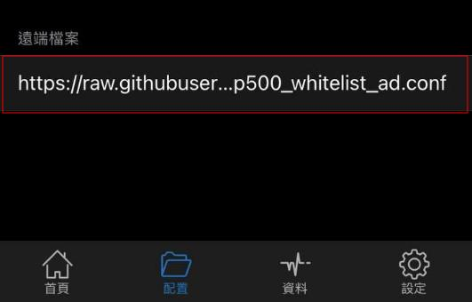
  
  成功後，就能在**本地檔案**中看到新的配置文件，並且前面會有**橘色的黃點**，後面會**打勾**。你也可以自行預覽配置和更改配置。也可以更新配置。
  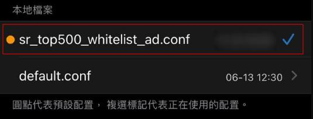
  
  **開啓HTTP解密**
  
  在主界面，點擊**配置**，輕觸本地文件欄中正在使用的配置文件，在彈出菜單點擊編輯配置。
  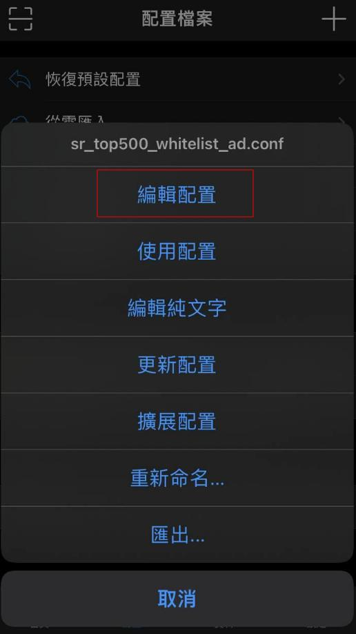
  
  點擊 **HTTP 解密**
  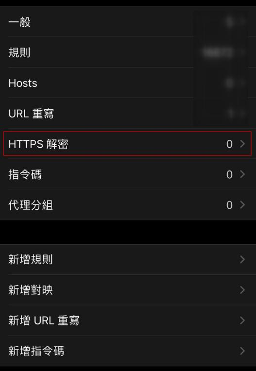
  
  打開**右上角的開關**，會彈出證書的安裝，先點擊安裝憑證，會跳轉到 Safari 下載證書文件。
  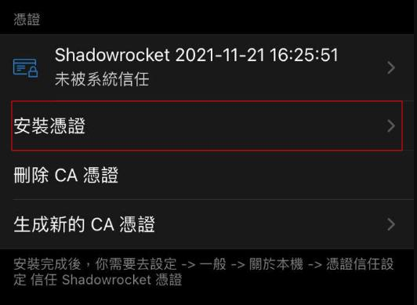
  
  進入手機系統**設置**，點擊**一般**，找到 **VPN 與裝置管理**，在設定描述欄中，安裝 Shadowrocket 的文件。
  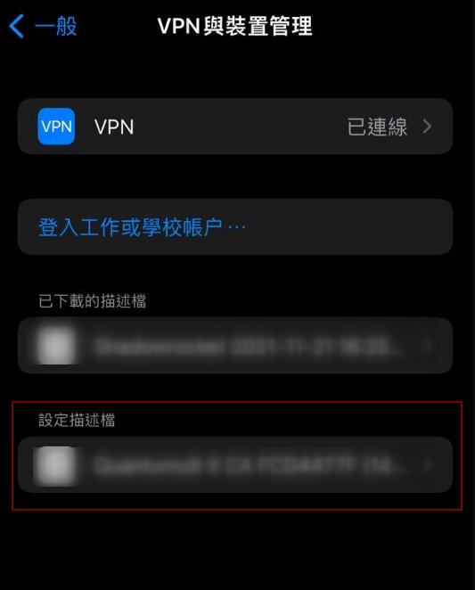
  
  安裝完成後，再在**一般**中，點擊關於本機，點擊**證書信任列表設定**，開啓 Quantumult X 證書的完整信任。
  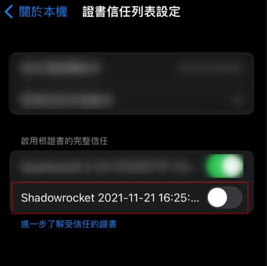
  
  再回到 Shadowrocket ，點擊剛剛界面 **右上角的「勾」**。
  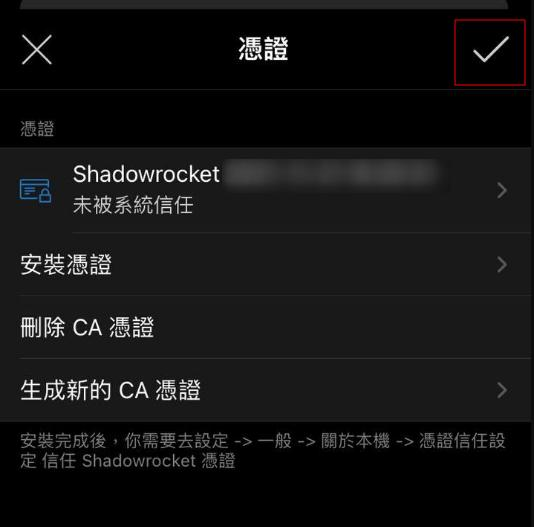

  這樣 HTTP解密 就開啓完成了。
  
  應用了這個配置之後，你的 Shadowrocket 就可以實現簡單的分流了(是否需要使用代理)和去廣告的功能了。
  
  再來實現**場景**的功能。
  
  這個功能上面有簡單介紹，根據設置不同的場景，可以自動切換節點或配置。例如你想外出時不使用代理，只在家中Wi-Fi下使用代理，就可以設定在使用移動網路時將路由配置設置爲**直連**。
  

  下面就簡單介紹下使用的方法。

  點擊**首頁--全域路由--設定-場景**
  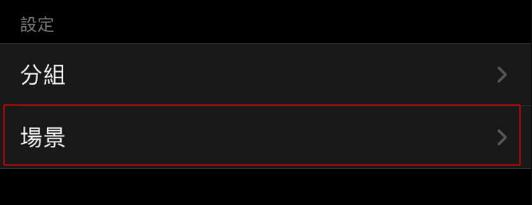
  
  點擊**新增場景**或**右上角+加號**
  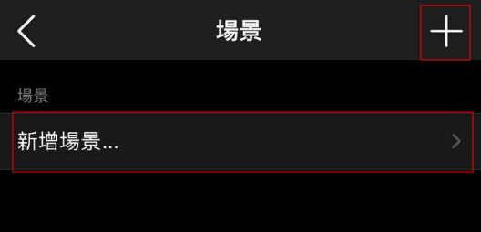
  這裏就可以自行設置，介紹一下每一欄對應的功能。

  **場景**：觸發模式的具體場景，可以選擇**無線局域網**或者**移動網路**。

  **SSID**：無線局域網的名稱

  **路由**：使用該場景時候的全局路由方式。

  **類型**：在使用場景時使用的類型，這個類型可以是單個節點，也可以是一個**分組**。

  **配置**：改場景下的配置文件。

  **備注**：該場景的一個名稱。

  完成後點擊儲存就可以了。然後在**全域路由**內選擇**場景**模式。

  最後來說說**分組**。這是 Shadowrocket 的一個功能，可以用來自動測試分組內節點的延遲，並會選擇延遲最低的來使用。使用分組功能可以替我們省去手動選擇延遲最低節點的時間。
  
  添加分組的方法也很簡單。
  
  點擊**首頁--全域路由--設定--分組**
  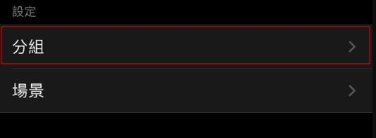
  
  點擊**新增分組**
  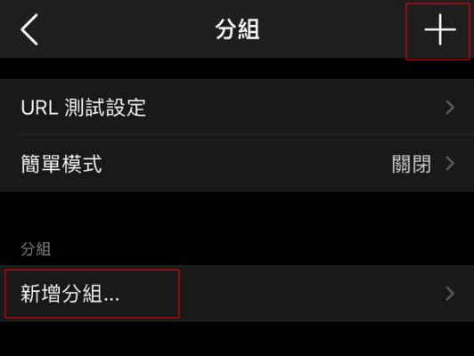
  
  爲分組取一個名字，然後將選擇所要加入分組的節點，點擊完成就可以了。
  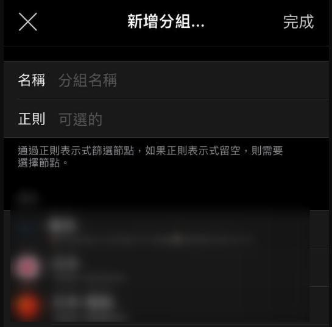
  
  最後要在**首頁**選擇**分組中的節點**，就可以正常使用了。
  
  也可以在**URL測試設定**，對測試延遲的內容進行自定義
  
* Quantumult X
  
  **一.簡介**
  
  一般的添加節點教程我就不再展示了，我下面的教程主要用來發揮一些 Shadowrocket 所沒有的功能。
  
  Quantumult X 是一款網路工具，似乎用來「翻牆」只是他衆多的功能之一。而且它支持運行 JavaScript 腳本和Mitm重写，所以可以進行應用分流，自動測試延遲和選擇節點，廣告攔截等功能。
  
  **二.購買**
  Quantumult X 在除中國大陸區以外的 App Store 都有上架。目前港區價格是 58 HKD。
  
  **三.進行基本功能配置**
  同上的 Shadowrocket 一樣，我也找到了 Github 上的一個關於 Quantumult X 配置的一個項目
  ```code
  項目地址：https://github.com/limbopro/Profiles4limbo
  ```
  
  1. 導入預配置文件
  
  打開 Quantumult X ，**輕觸**界面右下角的**風車圖標**。
  multX1.jpg)
  
  在**配置文件**欄中，點擊下載。
  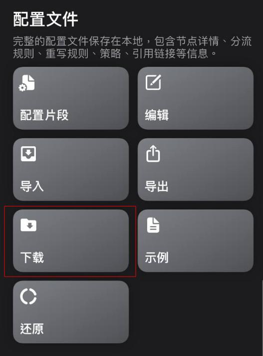
  
  在**輸入配置鏈接**中，輸入下面的鏈接，點擊右上角**「存儲」圖標**。
  ```code
  鏈接url：https://raw.githubusercontent.com/limbopro/Profiles4limbo/main/full.conf 
  ```
  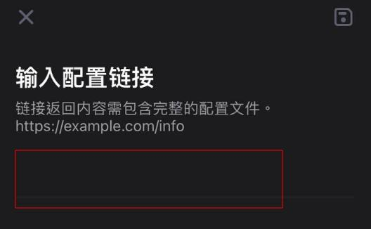
  
  回到主頁面，輕觸風車圖標，在**節點**欄中，點擊引用(訂閱)
  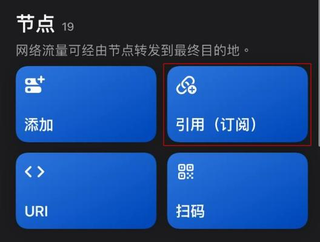
  
  將機場訂閱鏈接復制到**資源鏈接**中，並點擊右上角**保存圖標**。
  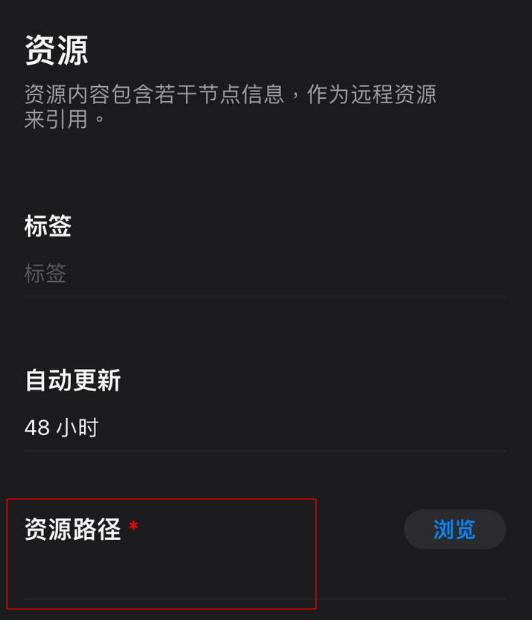
  
  回到主頁面，**長按**右下角風車圖標，先切換爲全局代理(藍色風車圖標)，然後在 proxy 選擇節點，打開右上角**開關**，輕觸主界面**左上角紅點**點擊**全部更新**，等待下載完成。
  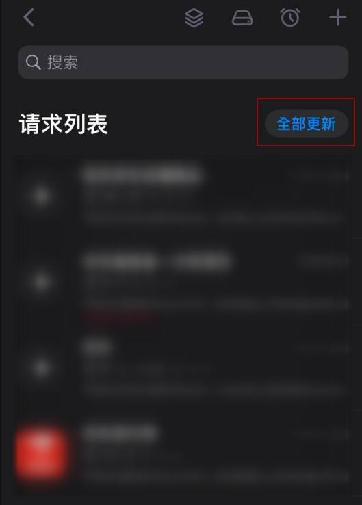
  
  更新完成後，再**長按**右下角風車圖標，切換回規則分流。
  
  2. 安裝並信任證書
  
  輕觸 Quantumult X 界面右下角風車圖標，找到 MitM ，點擊生成證書。
  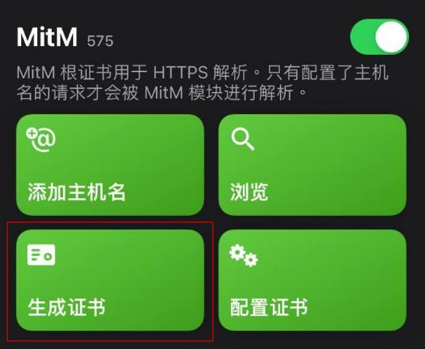
  
  再回到 MitM ，點擊配置證書，再點擊下載證書，這時會跳轉到 Safari ，點擊下載證書。
  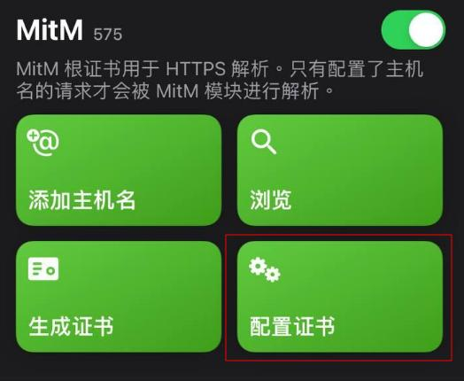
  
  進入手機系統**設置**，點擊**一般**，找到 **VPN 與裝置管理**，安裝 Quantumult X的文件。
  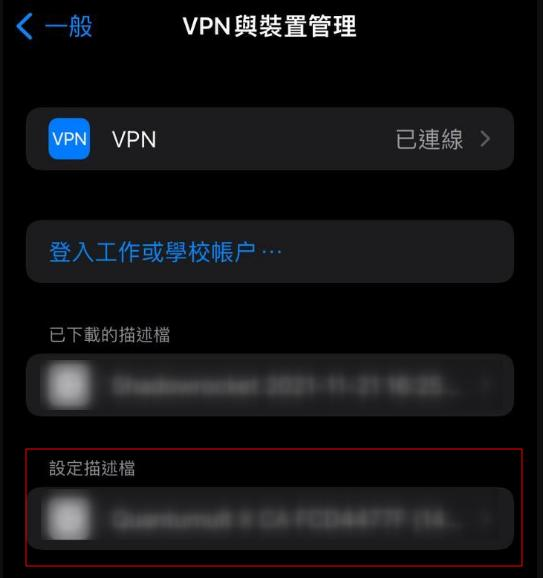
  
  安裝完成後，再在**一般**中，點擊關於本機，點擊**證書信任列表設定**，開啓 Quantumult X 證書的完整信任。
  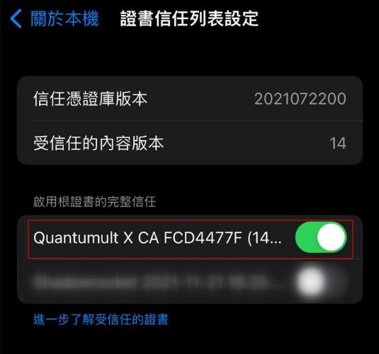
  
  再回到 Quantumult X，輕觸右下角風車，打開**重寫**和**MitM**的開關。
  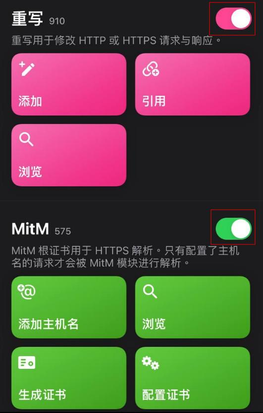
  
  3. 設置 GeoLite
  
  GeoLite 主要用來判斷你的網路活動是否爲國內 IP，從而選擇正確的分流方式。
  輕觸風車圖標，下拉到最下方，點擊**其他設置**
  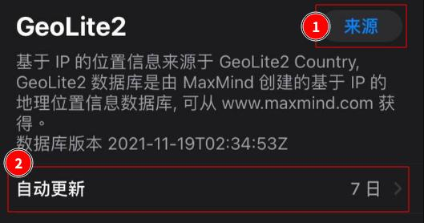
  下拉找到 GeoLite2，點擊來源，復制下方鏈接並打開自動更新。
  ```code
  鏈接url:https://raw.githubusercontent.com/Hackl0us/GeoIP2-CN/release/Country.mmdb
  ```
  
  4. 基本使用簡介
  
  因爲我們引用了別人已經寫好的預配置文件了。這裏來介紹一下選擇節點和應用分流的問題。
  
  在主界面 PROXY 欄下，是你自己添加的機場的節點。這裏使用的節點你可以自己選擇。
  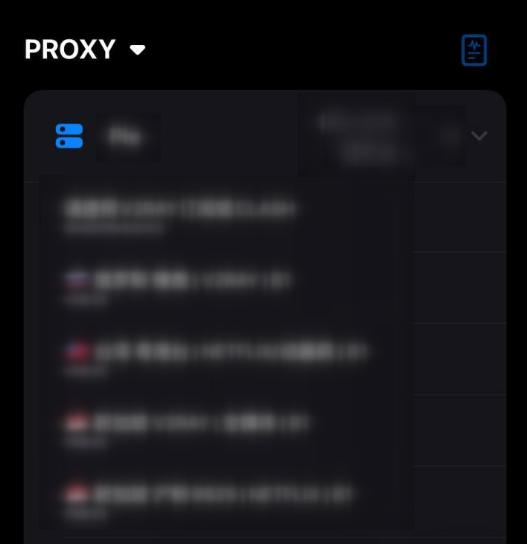
  在下方的自定義策略裏面，我們滑動仔細看看，其實是一些應用的名字，網站，功能，和國家。
  
  **應用**:這裏一般是用於應用分流。在這裏你可以自定義應用的代理。例如在使用 Netflix 時，如果你想觀看其他地區的節目，你可以直接爲 Netflix 選擇其他地區的代理，而不用更改全局代理的節點。
  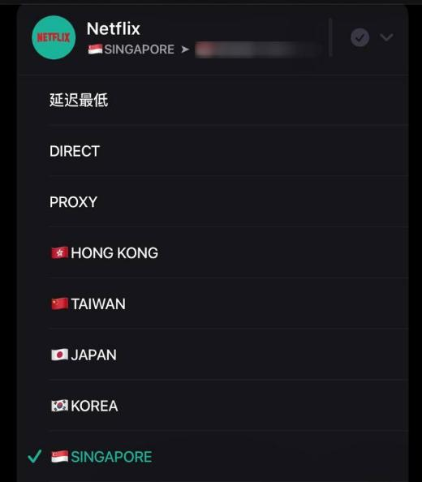
  **網站**:基本同上，實現對單獨網站的分流。
  
  **功能**:可以看到廣告攔截這一欄。DIRECT 則爲直連不開啓，REJECT 則爲全局代理，開啓
  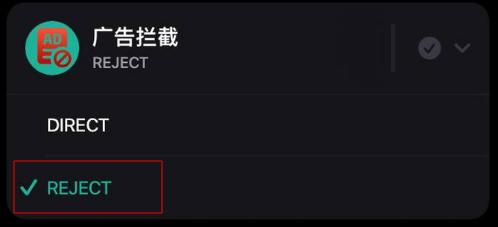
  **國家**:一般是根據你的節點連接到的國家，進行了**分組**。例如，若都是臺灣的節點，則會自動歸類到臺灣這一組的下面。這些分組的節點一般不能手動選擇，一般是根據延遲自動選擇。
  


#### **Linux**

因爲我本身是 Arch 的使用者，所以這裏只演示 Arch 的安裝方法 

*  Clash
  ```code
  sudo pacman -S clash-premium-bin // 安裝 Clash
  ```
  然後我們需要添加自己的 Clash 配置文件 config.yml 一般來說機場裏面會有訂閱地址，可以直接下載
  
  ```code
  cd ~/.config/clash // 打開到 Clash 的路徑下
  sudo pacman -S wget // 安裝 wget
  wget -O config.yml "xxxxxxxxxxxxxxx" // 下載 config.yml 
  ```
  >在把 XXXXXXXXXXXX 更改爲你的訂閱地址
  
  然後再下載 Country.mmdb 這份文件，點擊[這裏]進行下載
  
  接下來就可以執行 Clsah 了
  ```code
  clash -f .config/clash/config.yaml // 執行 Clash
  ```
  可以在 [Clash Dashboard](http://clash.razord.top/#/settings) 進行更換節點和延遲測試
  


#### **Windows**

* V2rayN

  先到 V2rayN 的 [releases](https://github.com/2dust/v2rayN/releases) 下載  **V2rayN-Core.zip**  
  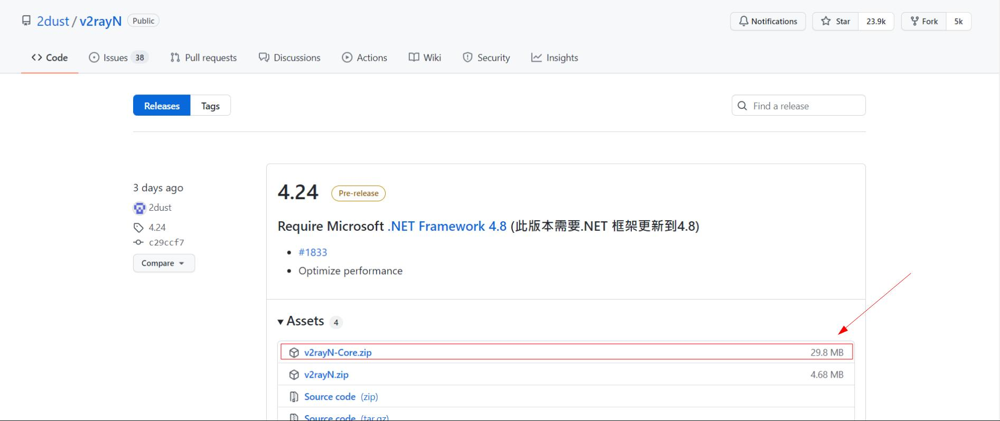

  下載完成後，解壓縮數據包，再點擊 **V2rayN.exe**,看到右下角任務欄的**藍色**圖標
  

  雙擊 圖標，打開圖形界面
  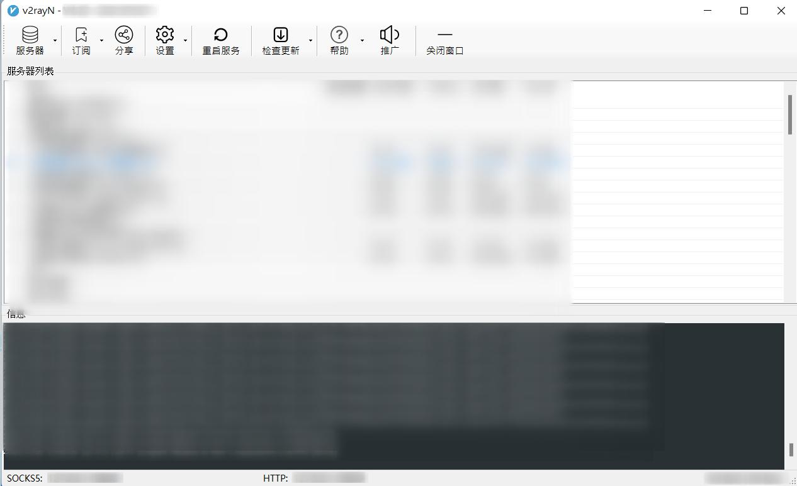

  接下來就要添加節點。一般我們會選擇添加訂閱的方式添加節點。
  點擊 訂閱-訂閱設置
  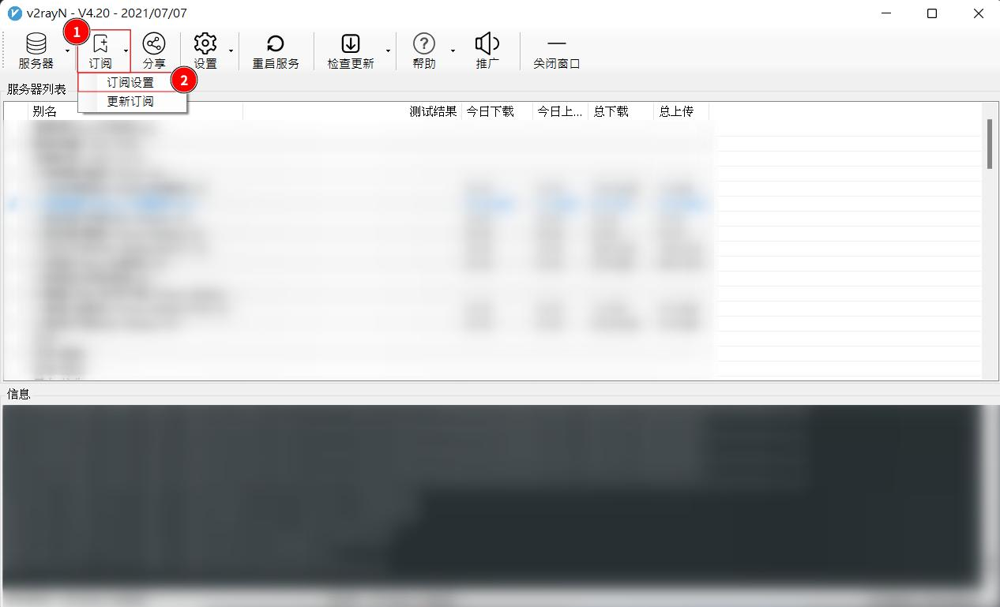

  點擊 添加 按鈕，在**地址**欄輸入你的訂閱地址 勾選 啓用 再點擊 確定
  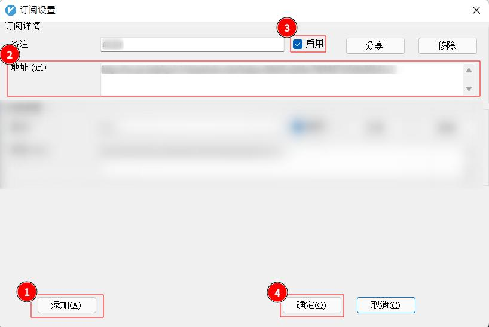

  點擊 訂閱-更新訂閱 這樣節點就添加完成了
  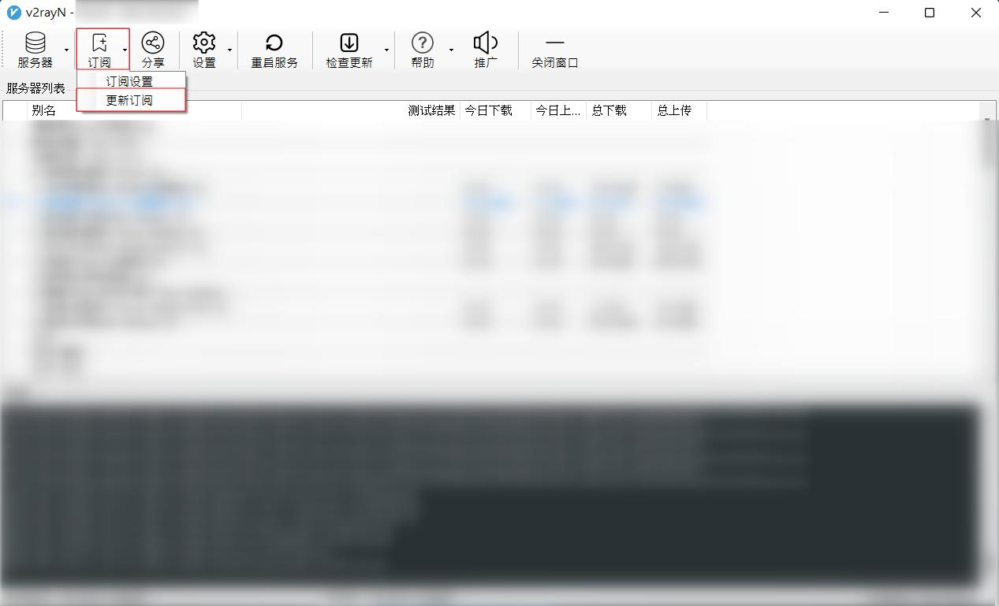

  然後 在任務欄中 右鍵-系統代理-自動配置系統代理
  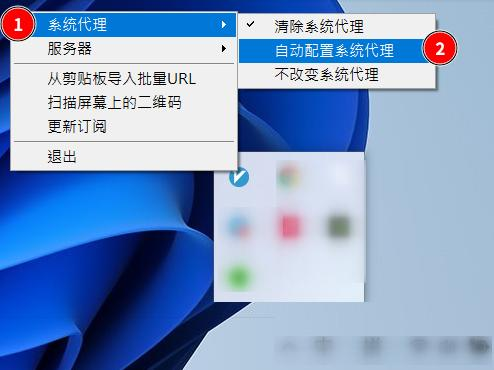

  完成後圖標就變 **紅色** 了，就可以正常使用了。
  
  在界面中，先選中節點，再回車就可以選中節點了。 

  在 服務器-測試服務器真延遲 就能測試節點延遲了。
  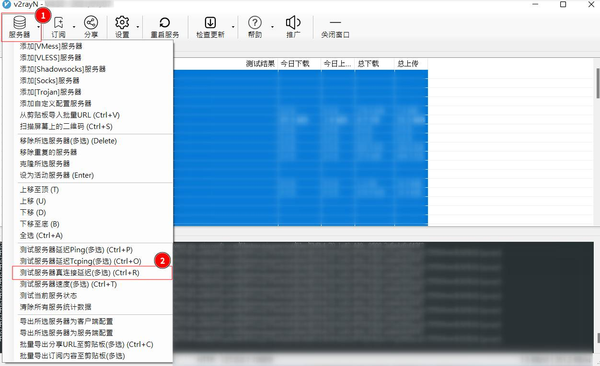 

  **Android**
  * V2rayNG

  先到 V2rayNG 的 [releases](https://github.com/2dust/v2rayNG/releases) 下載**v2rayNG.apk**
  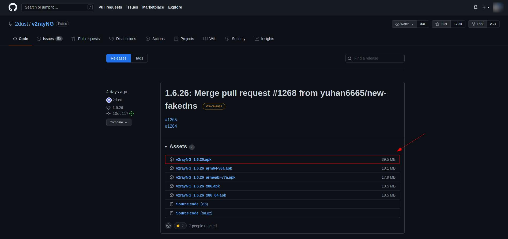 

  打開軟體
  

  點擊**左上角三條橫槓**，展開側邊欄
  

  點擊**訂閱設定**
  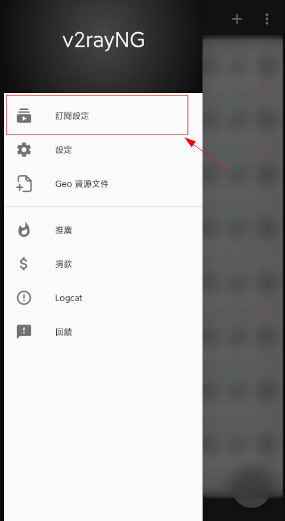

  點擊**右上角+**
  

  將機場訂閱鏈接輸入至** url 欄**，備注欄可以隨意填寫，再點擊**右上角的「勾」**
  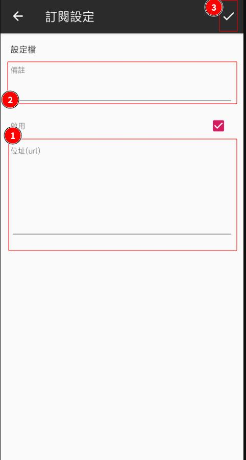

  回到初始界面，點擊**右上角三點**，選擇**更新訂閱**
  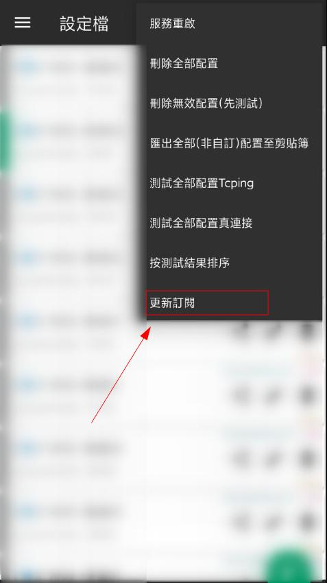

  這樣就能看到節點了，在列表中選擇節點，再點擊**右下角圓形圖標**，就已經可以使用了。
  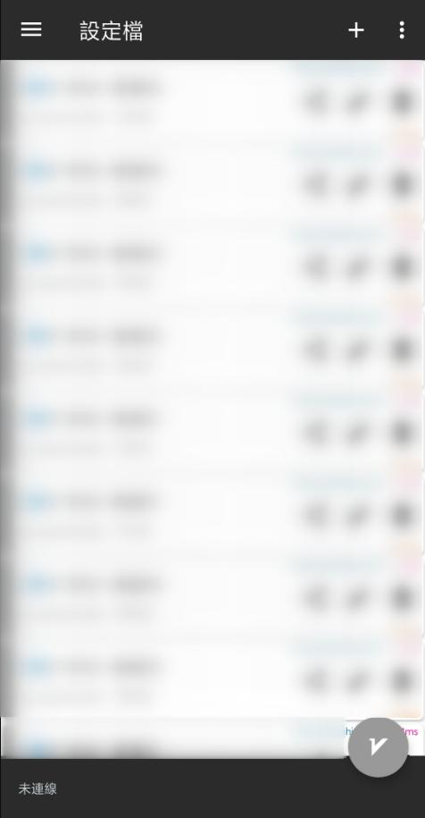

  點擊側邊欄，在**設定**當中，可以開啓**數綠顯示**
  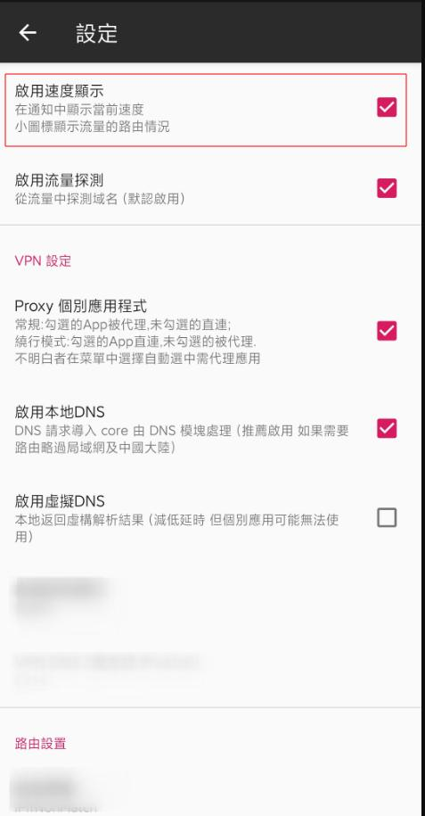

  也可以使用 **proxy 個別應用程式**，這樣就可以只讓需要被 proxy 的應用使用代理。
  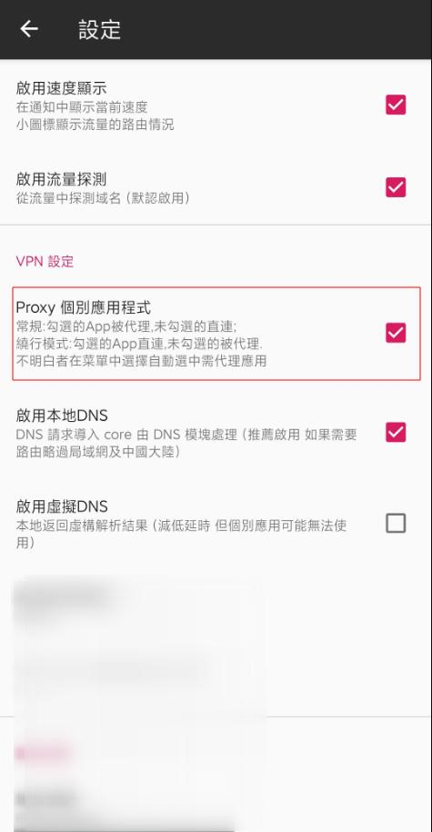 


## 一些「問題」

**關於不同「協議」的節點**

這裏說的是 SS，SSR，V2ray 等等節點的區別。其實他們的原理差不多一樣，只是有些加密協議或代理模式不同。

在用戶使用時，節點需要與客戶端對應起來才能正常使用。比如 Shadowsocks 客戶端無法運行 V2ray 的節點。 但也有一些客戶端是可以支持多種協議的節點的。例如 ios 中的 Shadowrocket 和 Quantumult X。還有各種系統上的 Clash 客戶端也是。

**爲什麼我推薦使用應用分流**

從實用角度來說，有些軟體或網站，不需要代理就可以訪問。有時開啓代理還可能會影響使用效果。從經濟角度上說，也可以爲你節省流量，把鐵用在了鋼刃上。
當然如果是 ios 用戶，Quantumult X 絕對是一個很好的選擇，不僅僅可以應用單獨切換代理，而且還可以運行 JavaScript 腳本，十分方便。

**關於代理端口的簡單理解** 

我用相對口語化的方式陳述。想象你的電腦的流量像是一根有着很多個「接口」的線路，而這一整根線就相當於你的宿主機地址 一般是 127.0.0.1 。在這個地址之下，就會分成很多個接口，也就是「端口」了。一般的 Proxy 在不開啓全局代理時，默認只會代理其中的一個端口，也就是只有這個端口的流量可以正常被代理。像是 Clash 的 HTTP 代理端口通常是 7890。有的時候我們明明開啓的代理，卻無法使用，很有可能就是你的軟體或者瀏覽器的流量端口沒有接上代理端口。

**推展推薦：**

[AK硬核翻牆系列](https://youtube.com/playlist?list=PLkjxal9L9K2YiL8o4P4pCWm-mHSfa2-kI)

[Quantumult X 綜合教程](https://yattazen.com/tutorial/quantumultx-config-guide.html)
