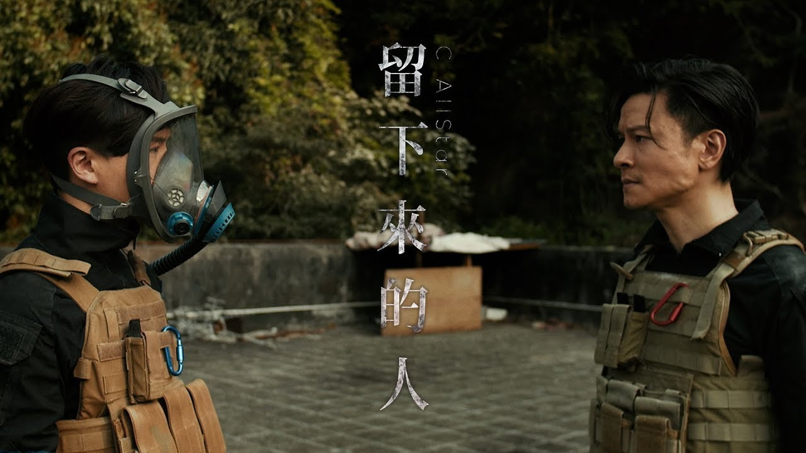

+++
author = "Wyane"
title = "移民浪潮中留下來的人"
date = "2021-07-13"
description = "《留下來的人》---C AllStar "
tags = [
    "Music",
    "C AllStar",
]
categories = [
    "Music",
]
series = ["Themes Guide"]
aliases = ["migrate-from-jekyl"]
image = "background.jpg"
license="Written by Daniel"
lastmod="2022-04-02"

+++

## 歌曲

這首歌是 C AllStar 回歸後的第二首派臺作品，表達的是人與人或物之間的留離之情，反映的也是香港近年來出現的移民潮。

重組的第一首《集合吧 地球保衛隊》，講的是‘相聚’；而第二首《留下來的人》，則說的是‘散’。 

或者人生就像如此，等不到下一秒，還來不及準備就馬上要離開。

>   呼吸多數萬次 難道這樣容易
>    
>   你最後那一口氣呼了便化煙
>
>   為何明明在眼前 明明同行但你臨時別去
>
>   放下句點  

離去的人只是單純的離去，卻留下了那無法釋懷的人。

>許多人都相信離開的人生走到該走的那時
>
>痛著來話別
> 
>可知留低的與重生的 卻在這邊
>
>怎撐過餘生的浩劫  

   

或許我們在電視劇集或者電影中都看到過類似的橋段，面對生離死別，留下來的那個人永遠是最難受的，時常會 想爲什麼離開的人不是我或者爲什麼不能陪他一起離開。

>差不多三百日了 沉澱過又懷念
>
>要記住你的一切 使世界亮了點
>
>原來仍能活過來
>
>仍能糊塗地愛悠然地笑 過著每天
>
>只可接受 新生活的蛻變 

一年的時間，似乎撫平了一些傷口。

>祈求站在世界的終端相擁嗎
>     
>還能如常還能再對話
>     
>若到那天 地球還未塌下
>     
>尚能期待某種永遠嗎  

地球不是結局，還存在着另一種永恆

>留低的與重生的 也在這邊
>
>即使費時一點 即使快樂不輕易
>
>最後仍可遇見

現在留下的人與先離開的人都還有機會重生，在一個美好的地方再遇見

>差不多九百日了 還是這樣懷念
>
> 説過在那一邊見 來待我出現
>
>你繼續沿途歷險
>
>我繼續尋求幸福了
>     
>那日見  

最後即使懷念，都是抱着積極的心態來面對，也激勵着我們留下來的人如何去做，再繼續去尋求屬於我們的幸福，最後再在天上與 「先離開的人 」再遇見。

## 時代意義

經歷了反修例風波和疫情影響的香港，傷痛似乎從19年開始就從未減少。

不少人選擇離港，離開這個陪伴成長的地方，離開這個具有獨特味道的地方。

《留下來的人》是在送給在大環境之下依然選擇留在香港的人。當然身邊人的逐漸離開，免不了的是傷感和無奈。不過在無奈之後，還是要面對自己的生活，自己如何在這塊土地上生活下去，即使它早就不是自己以前認知的樣子。

歌詞中 「 即使費時一點 即使快樂不輕易 最後仍可遇見 」讓我想起了林夕寫的《約定》。或者離開，或者留下，都要保重自己，撐到最後能再遇見的那天，實現大家的[煲底之約](https://zh-yue.wikipedia.org/wiki/%E7%85%B2%E5%BA%95%E4%B9%8B%E7%B4%84)。

C AllStar 這首反映如今香港人情景的歌曲，也再次得到了港人的回應，成爲了繼《集合吧 地球保衛隊》之後的第二首[五臺冠軍歌](https://zh.wikipedia.org/wiki/2021%E5%B9%B4%E5%BA%A6%E9%A6%99%E6%B8%AF%E5%90%84%E5%A4%A7%E9%9B%BB%E5%AD%90%E5%82%B3%E5%AA%92%E6%A9%9F%E6%A7%8B%E5%86%A0%E8%BB%8D%E6%AD%8C%E6%9B%B2%E5%88%97%E8%A1%A8)。《留下來的人》既是一份臨別禮物，也是一個情緒出口。給更多人能夠從這首歌中，得到激勵，努力去做好留下來的人要做的事情。

祝福香港，即使快要沉沒，也能有更多留下來的人撐起這片土地。

​      
