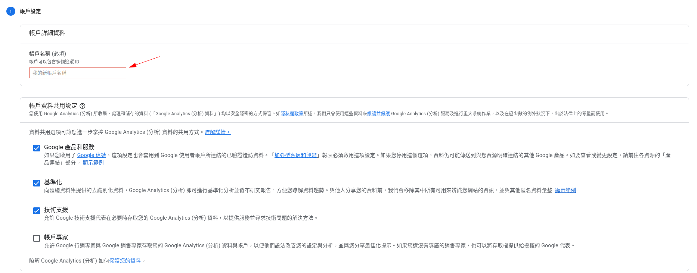
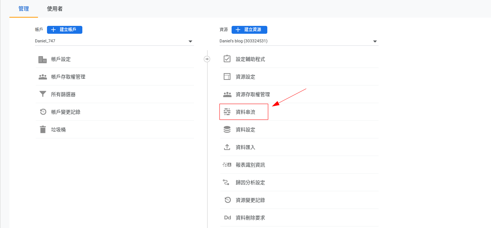
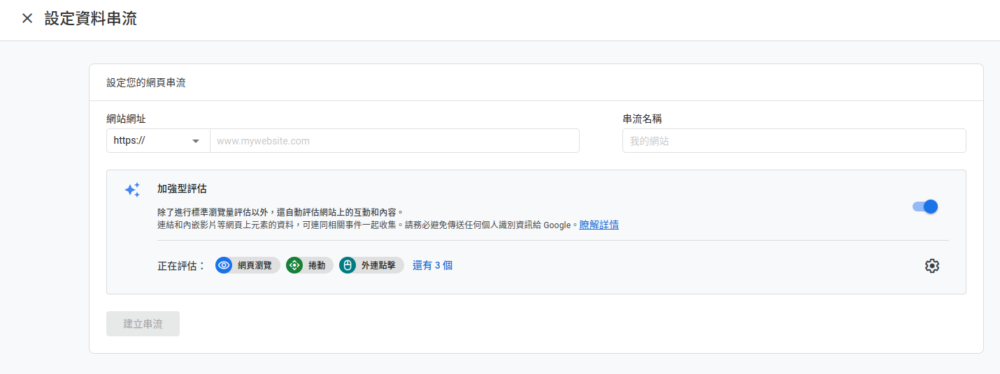
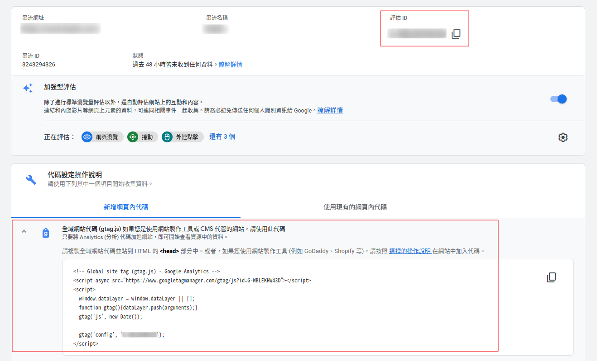
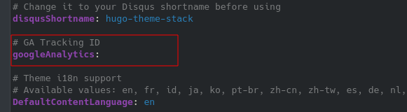
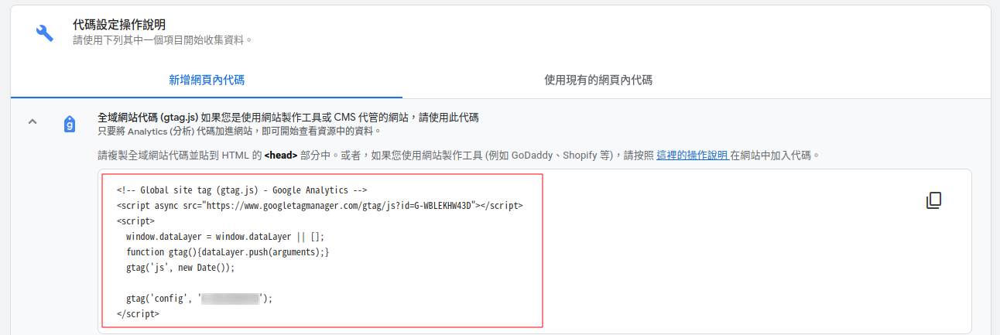
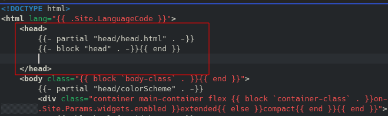

+++
author = "Wyane"
title = "Blog 後臺管理工具：Google Analytics"
date = "2022-02-12"
description = "「Blog」教程系列文章"
tags = [
    "Technology",
    "Blog",
]
categories = [
    "Technology",
]
series = ["Themes Guide"]
aliases = ["migrate-from-jekyl"]
image = "background.jpeg"
license="Written by Daniel"
lastmod="2022-04-02"

+++

## 引言

  在架設了網站後，可能我們希望能夠看到自己的網站有沒有人瀏覽，每天有多少人瀏覽，這些人都來自那裏這樣一系列的數據。這時我們就需要用到 Google 旗下的一個網站管理工具 --- Google Analytics。Google Analytics 已經經過了很多年的升級，現在的使用可以說是十分的方便，也比較簡單，並且它可以將數據幫你按照你的需求進行整理，還能夠可視化的展示出你所要的數據。

  接下來就看看通過 Github Page + Hugo 所架設的 Blog 網站，該如何使用這個工具。

## 基本步驟

### 設置 Google Analytics  賬戶

  1. 打開 瀏覽器 進入 https://analytics.google.com/ ，登陸 Google 賬戶

  2. 點擊 `開始測量`  

  3. 先給自己的賬戶取一個新的 `帳戶名稱`，帳戶資料共用設定我是勾選了前三項，你也可以根據自己的需求勾選，然後點 `下一步`

  

  4. 給自己獲取的數據資源取一個新的 `資源名稱`，因爲是針對於自己的 Blog 網站資源，所以我就填了我自己的「Blog名稱」，然後再點擊 `下一步`

  5. 在商家資訊中，這裏就根據自己的情況填寫就好。在填寫完成後，點擊 `建立` 

  6. 然後只要 `接受` Google Analytics 服務條款合約就完成了

### 設置 Google Analytics 資源

  1. 進入主界面後，點擊左下角的 `齒輪圖標` 

  2. 先在右側欄中點擊 `資料串流` ，再選擇 `網站`
  
     
  
  3. 在網站網址中，輸入你的 Blog 域名，例如我輸入的是 `7waynelee.github.io` ，串流名稱可以填入你自己給你的 Blog 所取的名稱，都輸入完成後，點擊 `建立串流` 
  
     
  
  4. 接着就會跳出 `網頁串流詳情` ，在這當中可以獲得自己的 `評估ID` 和一串 `全域網站代碼` ，這在接下來會使用到
  
     
     
      
  
### Hugo 設置 config.toml

  接下來就需要將你的本地 Blog 文件進行一些修改

  1. 先到你的電腦中找到你的本地 Blog 目錄文件夾，也就是之前所創立的 `username-Hugo` 這個文件夾
  2. 進入 `username-Hugo`文件夾中

  3. 打開 config.toml / config.yml 進行編輯

  4. 在 google Analytics 後面，貼上 `評估 ID`，格式爲 `"G-XXXXX..."`                                                                                                                                                   如果你的 config 檔案中沒有這個變量，就需要自己創建一個新的變臉，格式爲 `googleAnalytics="G-XXXXX..."`

     

### Hugo 設置 google analytics html 調用模板

  1. 進入 username-Hugo/themes/hugo-theme-stack/layouts 目錄下

  2. 創建一個名爲 `_internal` 的文件夾

  3. 打開 `_internal` 文件夾，創建一個名爲 `google_analytics_async.html` 的檔案

  4. 使用 *文字編輯器* 打開 `google_analytics_async.html` 檔案

     > 這裏直接 `左鍵` 雙擊打開，容易通過瀏覽器直接開啓。可能需要 `右鍵` ，選擇記事本類的軟體打開，才能編輯。

  5. 在 Google Analytics 網站上，將剛剛在網站中得到的全域網站代碼複製，再粘貼到 `google_analytics_async.html ` 這個檔案中

     

  6. 再打開 `username-Hugo/themes/hugo-theme-stack/layouts\_default\` 到這個目錄下

  7. 找到裏面的一個名爲 `baseof.html` 的檔案，使用*文字編輯器* 打開 `baseof.html`，在 ＜head＞…＜/head＞之間粘貼上以下代碼：

  ```code
  {{ if not .Site.IsServer }}
    {{ template "_internal/google_analytics_async.html" . }}
  {{ end }}
  ```

  

* 回到 Blog 文件夾根目錄，重新通過 `hugo` 編譯並上傳到 Github

## 結語  

  這樣以後，在 Google Analytics 中，就可以看到每天網站的訪問量，訪問地址，停留時間等等的數據。Google Analytics 大部分的數據都是以模塊的方式呈現，也是十分的方便，可以讓你自由的選擇需要看到的數據，可視化做的也不錯。

  在你剛剛設置好的時候，Google Analytics 是還沒有數據的。在經過一段時間的收集後，慢慢的就會展示出來了。當然剛架設的網站訪問量不高也很正常，只要後續的網站更新頻繁或者瀏覽的人數越來越多，Google 對你的網站的評級也就會慢慢升高，慢慢的訪問量就會上升了。

  關於 Blog 的系列文章，到這裏也就基本完成了，也差不該告一段落了。希望可以幫助到你們，擁有一個比較舒適的環境，存放自己的文字，擁有一個屬於自己的 Blog 網站。如果過程中需要幫助話，可以通過 `About` 界面下的 *Telegram* 鏈接和我取得聯繫，我也會儘量的幫助你。


