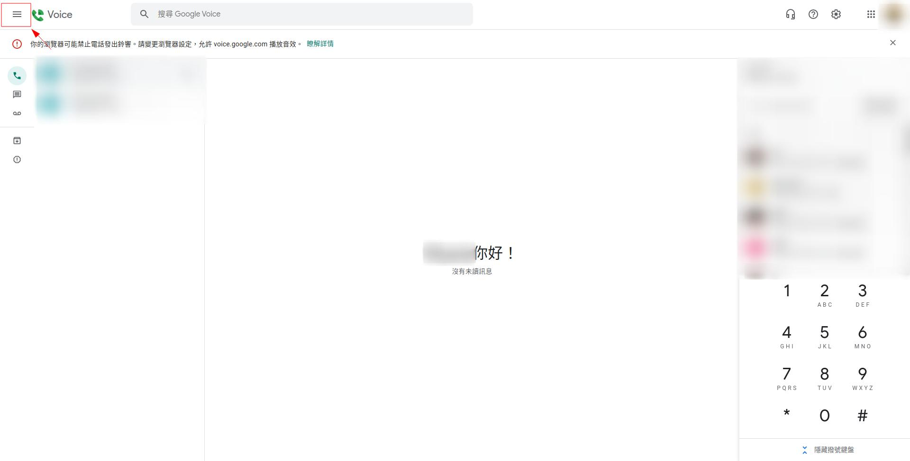
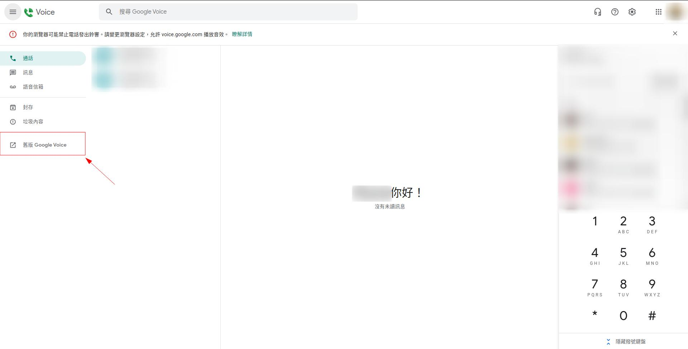
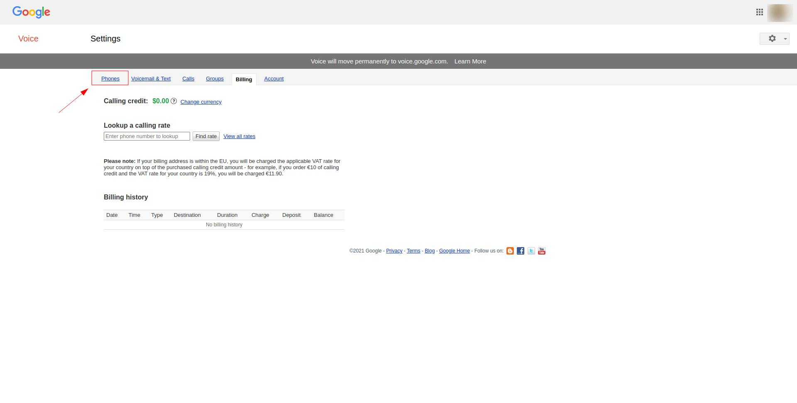
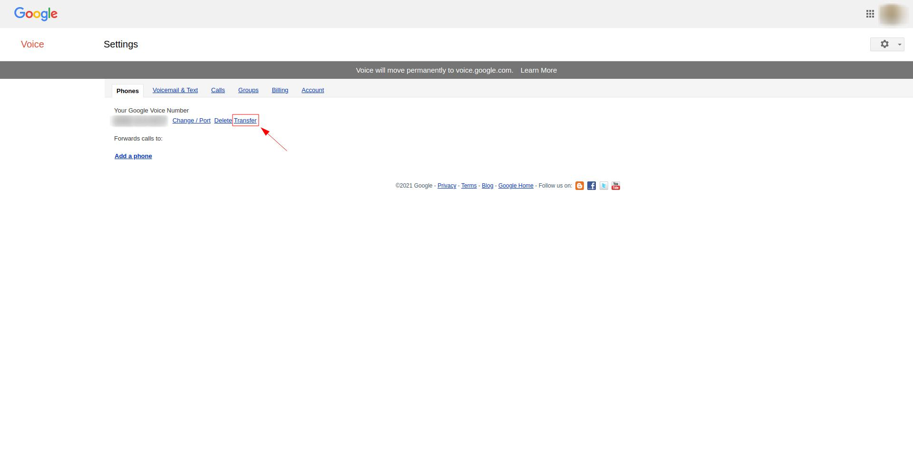
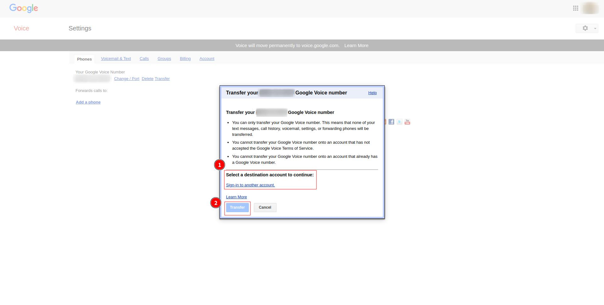
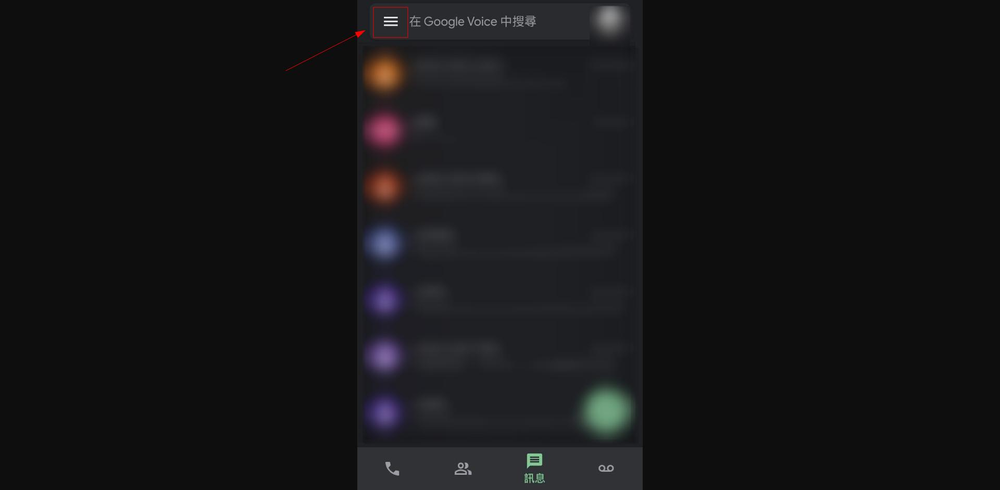
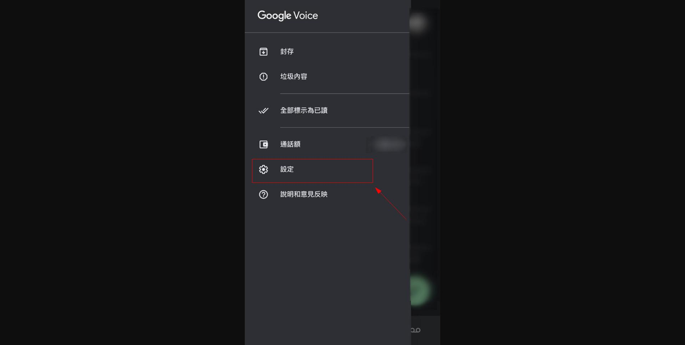
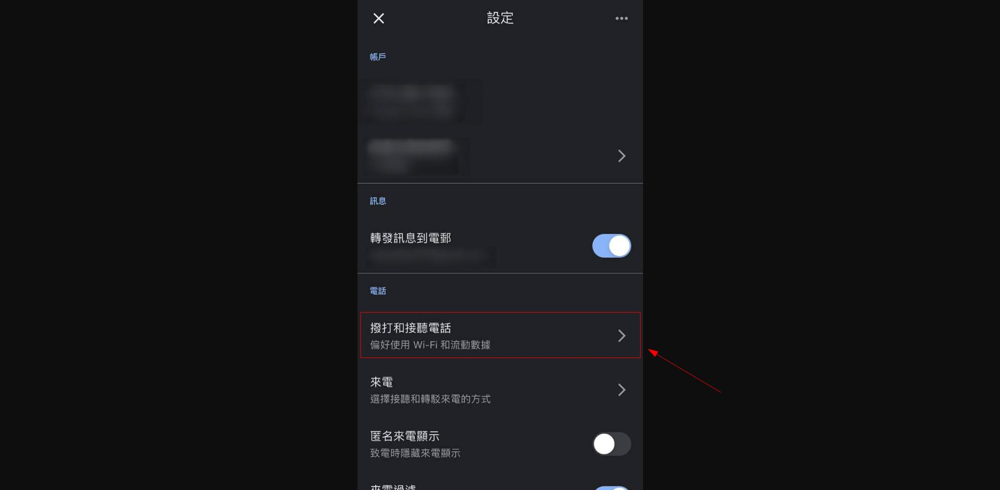
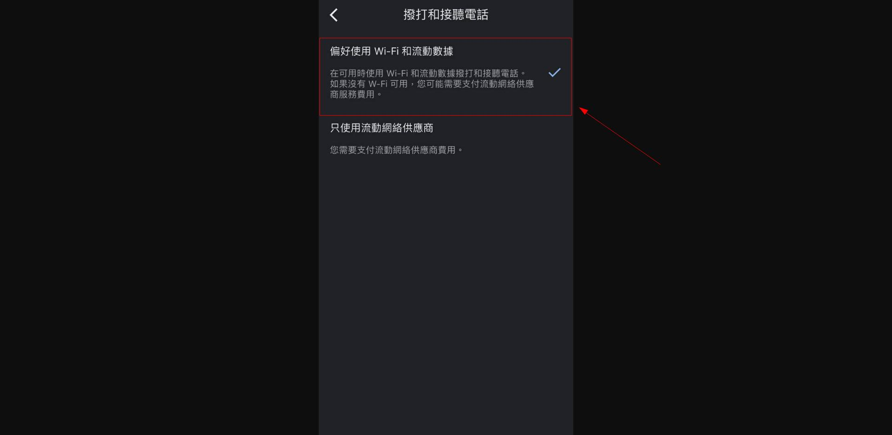

+++
author = "Wyane"
title = "Google Voice 虛擬號的一些使用方法"
date = "2021-10-31"
description = ""
tags = [
    "Technology",
]
categories = [
    "Technology",
]
series = ["Themes Guide"]
aliases = ["migrate-from-jekyl"]
image = "background.jpg"
license="Written by Daniel"
lastmod="2022-04-02"

+++

## 簡介
### Google Voice 是什麼？
[Google Voice](https://en.wikipedia.org/wiki/Google_Voice) 是 [Google](https://en.wikipedia.org/wiki/Google) 提供的**虛擬電話**服務，當你使用此服務時，可以理解爲 Google 給了你一個美國的電話號碼，你可以把它應用在各樣的場景中。

目前，Google Voice 的申請僅限於美國和加拿大地區。

但如果已經申請了 Google Voice 在世界各地都是可以使用的。（可能會需要使用proxy）

### Google Voice 的功能
* 擁有有一個美國電話號碼
* 美國，加拿大電話簡訊均免費
* 可以收聽留言，並且可以下載下來
...

### Google Voice 的收費方式
Google Voice 接收各種簡訊是完全免費的;接聽或播出美國，加拿大的電話也是免費的。打電話到其他的地區則是要收費的。

### Google Voice 的使用年限
理論上只要保持**主動**使用，就可以長期的使用。Google 最近更新了最新的時限政策，把定期使用間隔由原來的6個月縮短至3個月，也就是說如果你的 Google Voice 在三個月內沒有**主動**使用過的話，就有很大幾率被 Google 回收。當然回收前 Google 會發一封郵件提醒你。
>注意這裏所說的是主動使用，是指你主動撥打電話或發出短信

## 購買
由於虛擬號的一些特性和 Google Voice的易用性，使得它擁有者不錯的市場。基於 Google Voice 十分容易申請，於是也就衍生了許多的 Google Voice 虛擬號批發商。

如果你處在美國和加拿大以外的地區並且沒有美國或加拿大的電話實體卡，可以去網上購買此號碼。

## 轉移方法
>此方法可能只適用於你在批發商上購買了 Google Voice 的情況 
>
>如果是在個人 Gmail 上申請則不需要轉移

當你從批發商上購買了號碼後，批發商一般會提供給你這個帳號的**帳號郵箱**,**帳號密碼**,**帳號輔助郵箱**。這些信息可以幫助你登錄上並使用 Google Voice，有些人可能會修改帳號密碼和輔助郵箱來加強對此帳號的管理，但這個方法是不夠完善的。這個方法只能防止商家二次登錄此帳號，卻不能防止 Google 回收此帳號。因爲大部分被批發商用來申請 Google Voice 服務的郵箱，都是所謂的**垃圾郵箱**，可能是通過各種方法申請到的空殼郵箱。而 Google 每年都會從數據庫中清除大量的垃圾郵箱，所以你所買到的郵箱有很大幾率會在將來的某一天被 Google 所回收。

如果你不希望此號碼被 Google 回收，那麼我推薦你將此 Google Voice 號碼轉移到個人 Gmail 下。

### 第一步
如果你不在美國境內，那麼首先你需要準備一個**美國原生**節點，即一個**美國原生IP的節點**。如果沒有，那麼轉移過程無法完成。

[檢測是否爲原生IP的方法](https://bgp.he.net/)

準備好後，連接上節點，進入 Google Voice 網站，登錄上你**接收轉移號碼的帳號**，即你的**個人帳號**。

如果你的個人帳號是第一次登錄此網站，Google Voice 會要求你通過他的一些協議，只要點通過就好。
>這個隱私通過頁面只有在你使用美國原生節點接入時才會彈出，如果是其他節點的話可能會彈出**抱歉，你的國家不支持此服務**的字樣。但在你轉移完成後，再使用 Google Voice的服務是不限於美國節點的。

### 第二步
* 登錄上你所購買 Google Voice 所得到的帳號，進入到主界面，點擊左上角的 **三條槓** 按鈕;

* 點擊 舊版 Google Voice 按鈕

* 點擊 Phone 按鈕

* 點擊 Transfer 按鈕

* 在 Select a destination account to continue: 下方 找到你的個人 Gmail 並選擇，然後點擊 Transfer

>如果在第一步中登錄個人帳號時沒有通過 Google Voice 的協議，則在這步郵箱是無法選擇的

* 之後只要等待轉移完成就好了

## 使用 Google Voice 的基本功能
如果要實現 接打電話，收發簡訊等功能，在網頁端上是可以實現的。

但如果要在移動端上使用網頁來完成這些事情，又有些不太方便。我們可以使用 Google Voice App 來解決 
>在2021年4月份後， Google 基本停止了其他的軟件撥打電話的功能
>但如果只要收簡訊的話是可以在 Gmail 上收取

Google Voice App 都只分別在Appstore和play store的美區，加拿大區上上架。

如果是 Android 用戶，可以考慮下載apk進行安裝。

如果是 ios 用戶，一定需要一個 ios 美區帳號才能下載安裝。

安裝完成後登錄 Google 賬戶，如果正常綁定了Google Voice 號碼，就已經可以使用了。

### 撥打電話
當你第一次想要試試撥打電話時，界面會彈出要求你的實體卡號碼來進行關聯。如果你不想關聯，可以用一下步驟關閉：

* 點擊左上角的  **三條槓** 

* 點擊 設定

* 點擊 撥打和接聽電話

* 選擇 偏好使用 Wi-Fi 和 流動數據

這樣就可以不綁定實體卡撥打電話了

### 接聽電話
當你接通電話時，會有一段 Google 的語音提示在前面。可能有時候你沒有聽清，只等着他講完你再接通，那麼你可能會發現通話會自動掛斷。

其實，前面的語音提示是在詢問你要立即通話還是保存到語音信箱，如果選擇前者，你需要在撥號鍵上按“**1**”;如果是後者，你就需要在撥號鍵上輸入“**2**”。

## 注意事項
* Google Voice 號碼是可以注冊**大部分**App，包括 Telegram，Signal，Paypal等應用，但也有一些應用是無法直接注冊的，例如 Wechat。Wechat 只能用其他手機號碼注冊成功後，再更換綁定成 Google Voice 的號碼。
* **一定不能**用 Google Voice 號碼再注冊 Google 賬戶，這樣的套娃操作可能會導致 Google 封號並回收此號碼
* 最好頻繁使用 Google Voice ，防止 逾期後，Google 回收號碼。