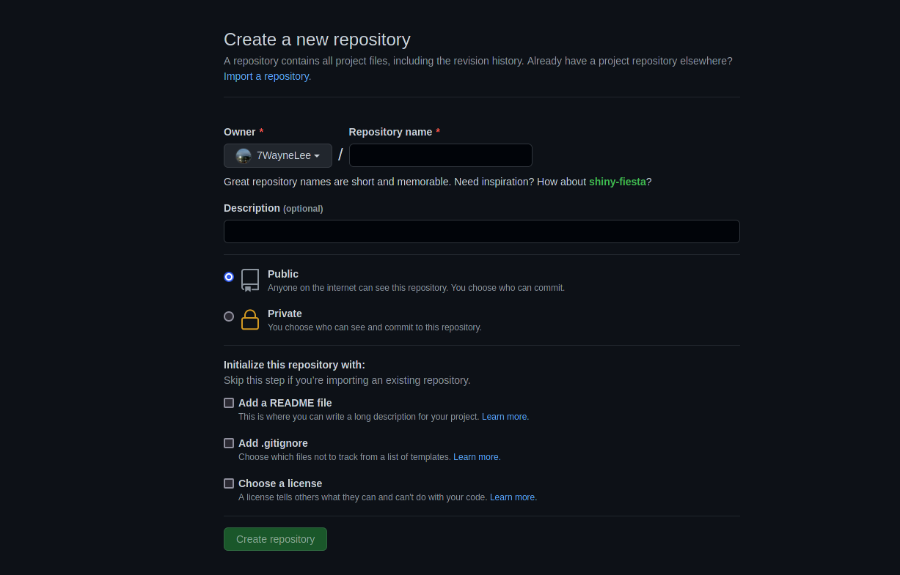
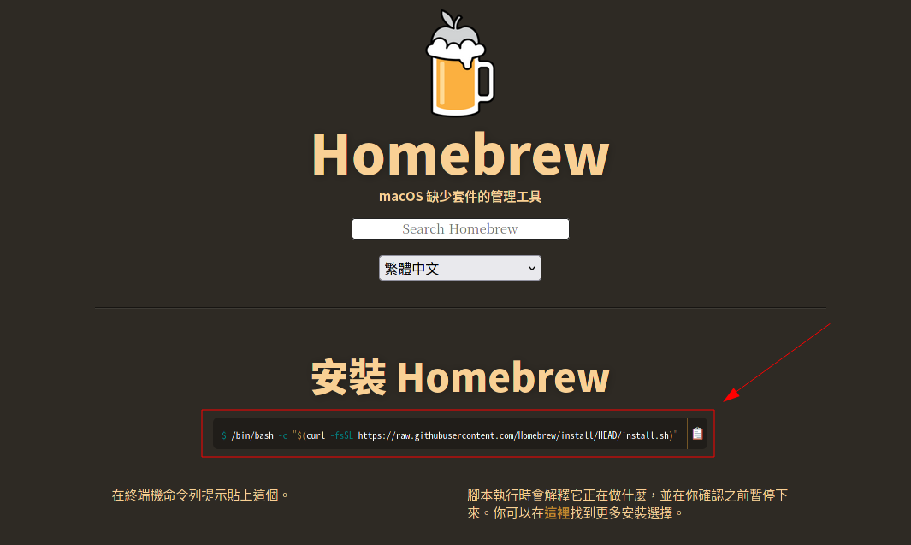
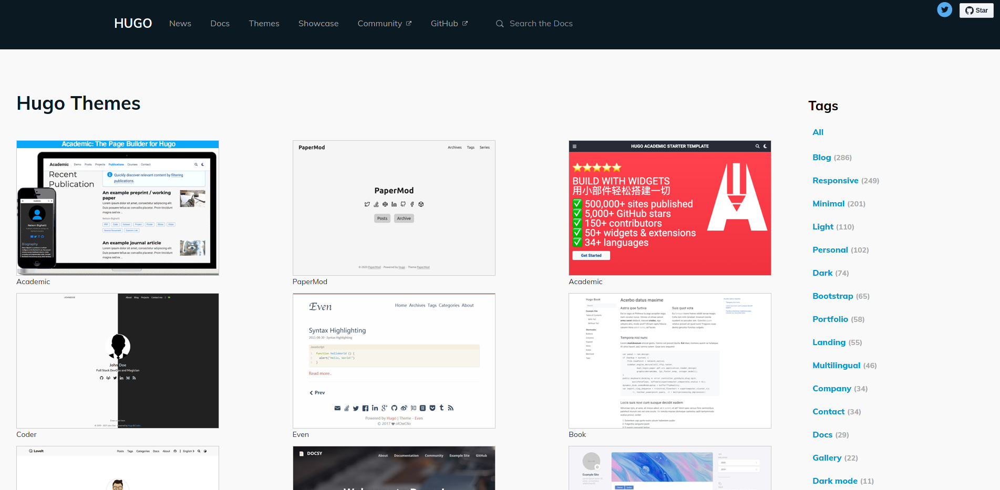
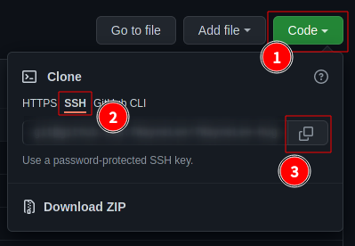

+++
author = "Wyane"
title = "Blog 的搭建：使用 Github Page + Hugo 架設一個屬於自己的 Blog"
date = "2022-02-08"
description = "「Blog」教程系列文章"
tags = [
    "Technology",
    "Blog",
]
categories = [
    "Technology",
]
series = ["Themes Guide"]
aliases = ["migrate-from-jekyl"]
image = "background.png"
license="Written by Daniel"
lastmod="2022-04-02"

+++

## 引言

  此教程是使用 Github Page + Hugo theme 建立一個個人的 Blog。 文章教程的主要環境是基於 `Mac OS`，如果你的電腦系統是 `Windows` 或其他的操作系統，那在實際的操作上，可能會和我文章中所寫的有出入，但基本的思路還是一樣的。

  在這個喜歡速食快餐的時代，或許 Blog 的意義也幾乎化等爲零了，因爲大部分的人並不再會過多的瀏覽長篇文字。但對於喜歡文字記錄的人來說，能將自己的想法與情感記錄下來，也是一種特別的情懷。類似於一份「電子日記」，能將你的現在，帶到若幹年後的未來。

  也希望能幫助到你，擁有一個屬於你自己的「文筆庫」。

  

## 基本教程

### **使用 Github 建立一個新的專案**

  開始，可能很多人要問了， [Github](https://zh.wikipedia.org/wiki/GitHub) 到底是個什麼東西？ 就拿 ig 舉例，衆所周知，ig 是一個社交媒體，可以將自己的生活日常和想po的po到上面，給自己的朋友們看到。所以，其實也可以把 Github 當作成一個程序員的社交媒體，只不過po在上面的，都是你自己寫的代碼專案(code)，你可以將自己寫的代碼傳到上面，建立成一個專案，你可以將這個專案設置成公開專案，別人就可以看到你上傳的代碼內容了。如果別人喜歡你的專案，他也可以點贊、追蹤，甚至可以讓別人和你一起修改你的代碼內容。

  所以，我們可以把 Github 當作是你 Blog 的服務器端，你需要將自己的專案po在上面，這樣所有人都可以看到了。

**1. 注冊一個 Github 帳號**

**2. 在 Github 上建立一個新的專案 / Create a new repository** 

* 點擊主界面的 new 

* 在 Repository name 欄中 填寫 「`username`.github.io」  這裏的 `username` 指的是你自己 Github 帳號名稱

  因爲我的名稱是`7WayneLee`，所以我填的是「`7WayneLee`.github.io」



* 在下方選擇 Public 
* 在 Add a README file 前劃勾
* 點擊 Create repository

**3.依照上面的流程，再創建一個新的專案**

* 在 Repository name 欄中 填寫 「`username`-Hugo」 

*這兩個 repository 的作用是不同的，在後面我會提到*


### 在你的電腦上安裝 git 並配置

因爲使用 Github 所建立的 Blog 是只能通過 git 來傳輸文件的，所以我們需要在我們的個人電腦上安裝 git ，才能管理我們的 Blog。

#### **安裝 git**

* 點擊進入 [Homebrew](https://brew.sh/) 的網站

* 復制網站中間的那段 `code`



* 敲擊  `Command`＋空白鍵 在 搜索欄中查找 `terminal` 

* 打開 `terminal`

* 在 `terminal` 內輸入剛剛復制的 `code`  敲擊 `Enter`

  > 這裏可能會需要輸入 `password` 
  >
  > * 在 `terminal` 內輸入 `password` 是不會顯示出字符的，但實際上在你敲擊鍵盤時是會讀取到你輸入的內容的。
  > * 這裏的 `password` 一般是你的 電腦密碼 ，需要和你電腦所綁定的 Apple ID 密碼有所區分

* 等待 Homebrew 安裝完成後 再在終端機內輸入 `brew install git` 敲擊 `Enter`

* 等待 git 安裝完成後 我們輸入 `git --version` 敲擊 `Enter` 查看 git 是否安裝完成

  *如果已經安裝完成，則會返回你當前安裝的 git 的版本號*

#### **綁定你的帳號並配置 ssh**

繼續在 `terminal` 內進行配置

* 設置 git name 和 email 

  ```code
    $ git config --global user.name "XXX" //將 XXX 替換成你的 Github 用戶名
    $ git config --global user.email "XXX" //將 XXX 替換成你的 Github 郵箱
    $ git config --global  --list //可以看到你剛剛配置好的 username 和 email 
  ```
  
  > 在 輸入 `git config --global  --list` 後，會進入 `vim` 編輯界面，查看完成後退出這個模式需要用到 `vim` 指令
  >
  > 不保存退出：先敲擊 `Esc` 再輸入 `q！` ，最後敲擊 `Enter` 即可不保存推出編輯模式
  
* 生成 ssh 密鑰

  ```code
    $ ssh-keygen -t rsa -C "XXX" //將 XXX 替換成你的 Github 郵箱
  ```
  
  > 在需要你輸入時，敲擊 `Enter`就好了
  
  *之後會在指定的路徑下生成兩個文件，分別是 id_rsa 和 id_rsa.pub*
  
  *注意 當生成了兩個檔案後 是可以看到它們所保存在的路徑*
  
* 將生成的公鑰復制到添加到你的 Github 帳號內

  *1.照着剛剛生成檔案所存放的路徑，找到所生成的 id_rsa.pub 檔案 ，開復制裏面的內容*

  *2.進入 Github 網站 點擊 右上角頭像-點擊 Settings*

  *3.在左側的欄中 點擊 `SSH and GPG keys`*

  *4.點擊 `New SSH key`  title 中是輸入你的設備名 可以是 ‘ XXX’s Macbook ‘   將你剛剛復制的公鑰內容粘貼到 `key`  中 點擊 `Add SSH key`*

* 測試

  ```code
    $ ssh -T git@github.com 
  ```
  
  在出現信息後 在 「 Are you sure you want to continue connecting (yes/no)?」 後輸入 `yes`
  
  看到  Hi 後面是你的用戶名後 就說明大功告成了

### **本地建立檔案**

* 打開 `terminal` 在裏面輸入

  ```code
    $ brew install hugo //安裝 Hugo
  ```
  
* 等待安裝完成後 接着輸入

  ```code
    $ hugo new site username-hugo //建立一個新的網站
    $ cd username-hugo //使 terminal 打開路徑到 username-hugo 文件夾下
  ```
  
  `username-hugo` 是可以替換成任意名稱。只要是你方便記憶就好。像我的名稱就取成 `7WayneLee-Hugo` ,和 Github 上 的 repository 名稱一樣，這樣就不會混了。
  
* 新增主題

  在 Hugo 中，有許多的主題可以供你選擇。你可以在 [Hugo Themes](https://themes.gohugo.io/) 上找到一個自己喜歡的主題，然後安裝。

  

  這裏我會以我目前正在使用的主題 [Stack](https://themes.gohugo.io/themes/hugo-theme-stack/) 爲例。
  
  *1.新增 主題 theme*
  
  ```code
    $ git clone https://github.com/CaiJimmy/hugo-theme-stack/ themes/hugo-theme-stack
  ```
  
  > 如果你想使用其他的主題，可以 git clone 其他的主題使用 
  
  *2.打開 `username-hugo` 文件夾，將路徑下 `themes/hugo-theme-stack `的文件 `config.yaml` 復制到 `username-hugo` 文件夾中。然後刪除原本有的 `config.toml` 文件*
  
  *3.將 `themes/hugo-theme-stack/exampleSite` 路徑下的 `content` 文件夾復制到 `username-hugo` 文件夾中*
  
  *4.測試*
  
  在 `terminal` 中輸入
  
  ```code
    $ hugo //編譯文檔
    $ hugo server -D //架設到本地進行測試
  ```
  
  執行指令完成後，可以打開瀏覽器輸入 http://localhost:1313，就可以看到大致網站的樣子了。
  

### **部署 Blog 到 Github**

  還記得我們一開始建立的兩個 Repository 嗎？ 接下來就要用到它們了。

* 更改 `config.yaml ` 文件

  打開 `config.yaml`  對應進行簡單的修改

  ```code
  baseurl: https://example.com -> 更改爲baseurl: https://username.github.io/  //將這裏的username替換爲你的 Github 用戶名
  languageCode: en-us //可以不做修改
  theme: hugo-theme-stack //不做修改
  paginate: 5 //不做修改
  title: Example Site -> 更改爲 title： 你喜歡的 Blog 名稱 例如 Wayne's blog 
  ```

* 編譯 

  在 `terminal` 中輸入

  ```code
    $ hugo
  ```

  *等待編譯完成後，進行下一步*

* 將 `username-hugo` 文件夾連接到 Github 的 `username-Hugo` repository 上

  *1.先登錄 [Github](https://github.com/) 。登錄完成後，在左側 Repositorys 中 找到 `username/username-Hugo` 這個 repository ，點擊進入。*

  *2.點擊綠色 `code` 按鈕，選擇到SSH，並復制鏈接* 

  

  *3.連接*

  在`terminal` 中輸入 

  ```code
    $ git init
    $ git remote add origin git@github.com:username/username-Hugo.git //將你剛剛復制的鏈接 替換掉 git@github.com這一長串鏈接
    $ git add .
    $ git commit -m "Initial commit"
    $ git push -u origin master
  ```

* 將 `public` 文件夾連接到 Github 的 `username.github.io` repository 上

  *1.再回到  Github 在左側 Repositorys 中 找到 `username/username.github.io` 這個 repository ，點擊進入。*

  *2.點擊綠色 `code` 按鈕，選擇到SSH，並復制鏈接* 
  
  *3.連接*
  
  在`terminal` 中輸入 
  
  ```code
    $ cd public/
    $ git init
    $ git remote add origin git@github.com:username/username-Hugo.git //將你剛剛復制的鏈接 替換掉 git@github.com這一長串鏈接
    $ git add .
    $ git commit -m "Initial commit"
    $ git push -u origin master
  ```
  
* 等待上傳完成後，在瀏覽器中輸入 `username`.github.io 就可以看到你的 Blog 了！

  > 因爲網路和 Github 的願意，第一次部署完成的更新等待時間會比較長，需要耐心等待一下。

### **編輯你的 Blog**

* 修改你的 `config` 文件

  一般的 Hugo 主題，都會有一個 `config` 文件讓你自行修改配置。

  因爲每個主題作者習慣或者編寫語言的不同，每一個 Hugo 主題的 `config` 文件內容也不同。

  所以一般來說我們需要作者的主題文檔來搭配使用，看看什麼參數是可以自定義的，什麼是不可以的。

* 關於編輯文字的方法

  一般來說，都會使用 Markdown 語言來編寫 Blog 文章的內容和格式。

  可能你沒聽說過 Markdown 語言？ 沒關係 這只單純是一類標記語言。 你只要把它當作和 word 文檔 之類的辦公軟件理解就好了。

  當然作爲一類語言，它也是有專門的語法的。而大部分語法的作用，都是爲了編輯 blog文章的格式。像是 標題，字體，斜體，都是可以通過專門的語法進行編寫的。

* 從編譯到上傳的基本流程

  在我們寫好了一篇文章後，如何讓別人在訪問網站的時候能夠看見呢？

  *1.將寫好的文章 .md文件 放在 `content/post` 路徑下*

  > 如果你要在文章中添加圖片的話，就需要在 `content/post` 路徑下建立一個文件夾，然後將這篇文章和所有的圖片，都放在這個文件夾中。

  *2.編譯並上傳*

  > 以我的主題爲例

  在 `terminal` 中輸入
  
  ```code
    $ cd username-hugo //打開到 Blog 根目錄路徑下
    $ hugo //編譯
    $ cd public/ //將路徑更改到 public 中
    $ git add --all
    $ git commit -m "XX" //XX可自行修改，這個是你自己用來記錄這次修改的內容是什麼，類似於給這次更新取一個小標題，不要太長就好
    $ git push -u origin master
    $ cd ../
    $ git add --all
    $ git commit -m "XX" //XX可自行修改，這個是你自己用來記錄這次修改的內容是什麼，類似於給這次更新取一個小標題，不要太長就好
    $ git push -u origin master
  ```
  
  解釋一下 兩個 Repository 他們分別的作用。
  
  * username-Hugo 
  
    這是爲了做 Blog 的**源碼**備份而建立的。
  
    相當於這個庫中的內容是你還未用 hugo 編譯前的內容。防止你的 Blog 源碼部分丟失。
  
  * username.github.io
  
    這個庫存放的是目錄中文件夾 public 的內容。
  
    而 public 的內容，是通過 hugo 編譯生成的，也就是你的網站的內容。
  
    這是用來部署你的網站的庫。
  
    通過這兩個庫進行保存，也是一種保護，防止你本地的文件因爲電腦丟失或者損壞而全部丟失。如果提前建庫備份，就不害怕本地的內容丟失了。


## 結語

  以上就是架設 Blog 的完整操作了。如果你順利看到這裏，並且同時也在一起動手的情況下，相信你也已經將你的 Blog 基本框架架設好了，也對這些框架和 git 有了一個簡單的認知。

  下一步就是需要編輯我們的 Blog 文章了。在第五點中，我有大概提到將 `.md`	檔案通過 Hugo 編譯並上傳到 Github 的基本操作了。但在這之前，我們還要先學習的是如何將你的文字通過 Markdown 語言進行編輯和排版。在下一篇文章中，我會介紹 Markdowm 語言是什麼，以及幫助你瞭解一些基本 Markdown 語言的編寫問題。

> 2.10 更新：[Blog 文章編輯語言：Markdown --- 語言學習筆記](https://7waynelee.github.io/p/markdown-%E8%AA%9E%E8%A8%80%E5%AD%B8%E7%BF%92%E7%AD%86%E8%A8%98/) 

  希望這篇文章能幫助到你！

