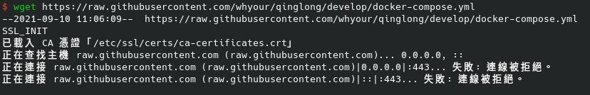
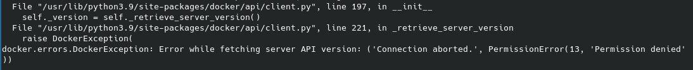
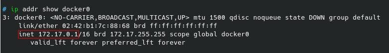

+++
author = "Wyane"
title = "配置青龍面板並實現京東JS腳本運行"
date = "2021-09-10"
description = " "
tags = [
    "Technology",
]
categories = [
    "Technology",
]
series = ["Themes Guide"]
aliases = ["migrate-from-jekyl"]
image = "background.jpg"
license="Written by Daniel"
lastmod="2022-04-02"

+++

## 簡介
[青龍面板](https://github.com/whyour/qinglong)是運行在docker的一種容器 可以實現定時任務的管理 並且支持多種語言下的腳本 使用起來也十分方便 可以安裝在各種的 Linux 發行版上

其實官方的文檔中就已經編寫的安裝說明 但可能對於小白來說並不容易理解 

所以我就打算寫一個小白版本的安裝過程 讓更多人順利安裝

## 安裝教程
### 1.安裝docker及docker-compose
在 Arch Linux 直接調用 pacman 就可以安裝了

>先安裝 docker
```code
sudo pacman -S docker //安裝 docker
```

>再安裝 docker-compose
```code
sudo pacman -S docker-compose //安裝 docker-compose
```

>安裝好了之後 我們就要運行 docker 
```code
systemctl start docker.service //運行 docker
```

>當然 我們也可以把 docker 設置成開機自啓動 這樣就不用每次都運行指令了
```code
systemctl enable docker.service //docker 開機自啓
```

到了這步 docker 及 docker-compose 就都已經安裝完成了

### 2.安裝青龍面板

>新建一個文件夾（這裏文件夾名稱可以隨意）
```code
mkdir qinglong //新建 qinglong 文件夾
```

>開至文件夾目錄
```code
cd qinglong //打開至 qinglong 文件夾目錄
```

 >本仓库中的 docker-compose.yml 本地
 ```code
 wget https://raw.githubusercontent.com/whyour/qinglong/develop/docker-compose.yml
 ```
 >>注意  在下載中可能會出現 ERROR
 >>
 >>出現的443錯誤是因爲端口無法訪問
 >>有科學上網能力的可以將proxy設爲全局就可以啦
 >>```code
 >>export https_proxy=http://127.0.0.1:xxxx http_proxy=http://127.0.0.1:xxxx all_proxy=socks5://127.0.0.1:xxxx //把xxxx替換成自己的端口號就可以了
 >>```
 >>如果沒有科學上網能力 那就直接在本地創建一個 docker-compose.yml 文件 再到[項目](https://github.com/whyour/qinglong/blob/develop/docker-compose.yml)中把內容復制進去也可以

>啓動
```code
docker-compose up -d //啓動青龍面板
```
>>注意 在啓動中可能會出現如下錯誤
>>
>>我們需要將你的用戶添加到docker組中
>>```code
>>sudo gpasswd -a $USER docker //添加到組中
>>wgrp docker
>>sudo systemctl start docker //重啓一次 docker
>>docker-compose up -d //啓動青龍面板
>>```

默认情况下qinglong将会在5700端口启动，并将端口映射至容器所在宿主机，启动之后打开浏览器访问宿主机的5700端口
>>查找宿主機ip
>>```code
>>ip addr show docker0
>>```
>>
>>圖中 inet 後面的地址就是宿主機ip 172.17.0.1是我的ip地址


打開瀏覽器 輸入ip：5700 就會顯示登錄頁面
第一次账号密码均输入`admin`，会生成`auth.json` 頁面也會提示你輸入新的密碼
運行下面的指令獲取新的密碼
```code
cat data/config/auth.json
```
返回的结果类似如下字段
```code
{"username":"admin","password":"Xb-ZYP526wmg4_h6q1WqIO"}
```
我們將新的密碼復制輸入後，即可成功登錄青龍面板

## 使用案例一：運行京東腳本
在Github上 有許多關於京東JS腳本的項目 我們可以直接調用
推薦：項目地址  https://github.com/zero205/JD_tencent_scf

安裝步驟
>我們可以直接在 qinglong 文件夾目錄終端機中輸入
```code
docker exec -it qinglong_web_1 ql repo https://ghproxy.com/https://github.com/zero205/JD_tencent_scf.git "jd_|jx_|getJDCookie" "backUp|icon" "^jd[^_]|USER|sendNotify|sign_graphics_validate|JDJR" "main"
```
>腳本便會自動添加到面板中
>導入後我們便可以看到面板左邊側邊欄 配置文件 和 腳本管理 中新添了許多文件

再獲取京東 cookie
>1. 浏览器获取京东cookie教程 https://github.com/zero205/JD_tencent_scf/blob/main/backUp/GetJdCookie.md
>2. 插件获取京东cookie教程 https://github.com/zero205/JD_tencent_scf/blob/main/backUp/GetJdCookie2.md

獲取到的 cookie 我們導入到面板的 環境變量中
>點擊左側側邊欄的 環境變量
>點擊右上角 添加變量
>名稱 可以設爲 JD_COOKIE 將獲取到的 cookie 復制到 值 當中
>
>>這裏若是添加多個帳號 每個帳號之間的 cookie 要用 ; 隔開
>>每個帳號的 cookies 過了一段時間就會失效 失效了就要再重新獲取了 

然後就可以試着運行 定時任務 中的任務了

## 最後
青龍面板其實還有很多的使用方法 可以更多的探索

感謝開發項目並無私分享的大佬們！

